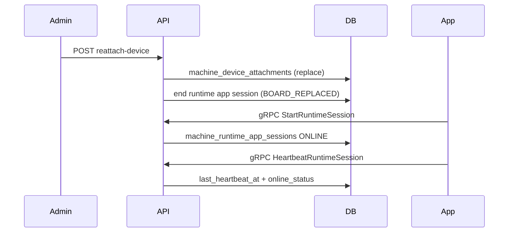

# Machine identity & runtime app sessions

Distinct session layers:

| Layer | Table | Purpose |
|-------|-------|---------|
| Credential | `machine_sessions` | JWT/refresh credential session (`runtime-sessions` REST) |
| Operator | `machine_operator_sessions` | Human technician/operator session |
| App runtime | `machine_runtime_app_sessions` | Vending app lifecycle (start/heartbeat/end) |
| Board | `machine_device_attachments` | Android board identity |

## Lifecycle (mermaid)

## Admin REST

- `GET /v1/admin/machines/ops-overview` — fleet list (filters: `online_status`, `machine_code`, `status`, `site_id`)
- `GET /v1/admin/machines/{id}/ops-overview` — enriched detail (android board, sim, runtime app session, credential session, operator session)
- `GET /v1/admin/machines/{id}/app-sessions/current|history`
- `GET /v1/admin/machines/{id}/device-attachments/current|`
- `POST /v1/admin/machines/{id}/app-sessions/{sessionId}/force-end|mark-stale`
- `POST /v1/admin/machines/{id}/activate|deactivate` — aliases for enable/disable

## gRPC (`MachineRuntimeSessionService`)

Machine JWT only. Methods: `StartRuntimeSession`, `HeartbeatRuntimeSession`, `EndRuntimeSession`, `GetRuntimeSessionState`.

## gRPC identity contract (claim / refresh / bootstrap)

| Field | Format | Used for auth / MQTT / DB FK |
|-------|--------|------------------------------|
| `machine_id` | UUID | **Yes** — JWT `machine_id` claim, MQTT username/topics, `MachineRequestMeta.machine_id` |
| `machine_code` | `AVF` + 6 digits (from `machines.code`) | **No** — display/UI only; returned on `ClaimActivation`, `RefreshMachineToken`, and `BootstrapMachine` |

REST claim already returns `machineCode`; gRPC now mirrors the same display field without changing runtime identity.

## Online status

Config: `MACHINE_ONLINE_THRESHOLD_SECONDS` (60), `MACHINE_STALE_THRESHOLD_SECONDS` (300). Derived from runtime heartbeat, check-in, and MQTT heartbeat ingest.
