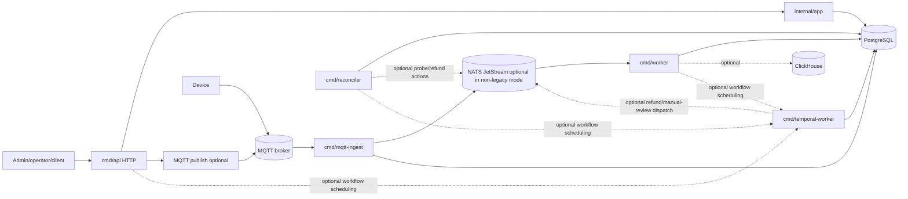

# Current architecture (as built)

This document freezes the **repository truth as implemented today**. It is intentionally concise and separates **already implemented**, **partially implemented**, and **not implemented yet** items so future architecture work can start from the current baseline instead of the target-state design.

## Current status

### Already implemented

- **Modular monolith layout:** multiple binaries under `cmd/*`, shared application logic in `internal/app/*`, and Postgres persistence in `internal/modules/postgres`.
- **HTTP control plane:** `cmd/api` serves the public/admin/operator/setup HTTP surface under `/v1`, plus health and optional Swagger/metrics.
- **MQTT device ingress:** `cmd/mqtt-ingest` subscribes to device topics and feeds the ingest pipeline.
- **Background processing:** `cmd/worker` handles outbox dispatch, reliability scans, telemetry JetStream consumers, and retention work.
- **Commerce reconciliation:** `cmd/reconciler` runs reconciliation passes against commerce data.
- **Internal gRPC queries:** `cmd/api` can expose authenticated internal-only gRPC query services for machine, telemetry, and commerce reads alongside `grpc.health.v1`.

### Partially implemented

- **MQTT-first runtime plane:** device ingress and command dispatch use MQTT, but production runtime flow also depends on NATS JetStream for telemetry buffering and worker-side async processing.
- **gRPC:** optional listener exists in `cmd/api` and currently mounts internal query/read services only; it is not used for device traffic or general workflow mutation APIs.
- **Object storage:** S3-compatible storage is live for backend artifacts when `API_ARTIFACTS_ENABLED=true`, but not yet a generalized storage plane for diagnostics or OTA.
- **Analytics path:** ClickHouse is optional and currently used only as a worker-side outbox mirror path when analytics flags are enabled.
- **Temporal:** selected long-running compensation/review workflows are implemented behind feature flags, with execution in `cmd/temporal-worker`; broader workflow coverage is still follow-on work.
- **Thin handlers / app boundaries:** the repo mostly keeps business rules in `internal/app/*` and persistence in `internal/modules/postgres`, but some HTTP and bootstrap logic still carries orchestration detail.

### Not implemented yet

- Broader internal gRPC mutation/workflow APIs.
- Broader Temporal workflow coverage beyond the current compensation/review set.
- A fully generalized object-storage-backed device diagnostics or OTA pipeline.
- A complete ClickHouse-first telemetry analytics plane.

## Current process map

| Process | Implemented today | Partial / optional | Not implemented yet |
| ------- | ----------------- | ------------------ | ------------------- |
| `cmd/api` | HTTP `/v1`, health, auth, admin/operator/setup/device/commerce routes; internal gRPC query services (`grpc.health.v1`, machine/telemetry/commerce reads) | Optional Swagger, metrics, MQTT publisher, artifacts, Temporal client/scheduler dial | Broader internal gRPC mutation/workflow APIs |
| `cmd/mqtt-ingest` | MQTT subscribe + ingest pipeline, Postgres-backed ingest fallback | JetStream telemetry buffering in environments with `NATS_URL`; Prometheus listener when enabled | Separate runtime-plane service outside this monolith |
| `cmd/worker` | Reliability scans, outbox dispatch, telemetry consumers, telemetry retention | NATS outbox publish/DLQ, ClickHouse outbox mirror, Prometheus/health listener | Standalone analytics service or separate event processor |
| `cmd/reconciler` | Commerce reconciliation reads and logging | Optional payment probe + refund enqueue path when `RECONCILER_ACTIONS_ENABLED=true` | Full end-to-end automated remediation workflow engine |
| `cmd/temporal-worker` | Executes registered Temporal workflows/activities for payment timeout, vend failure, refund, and manual review follow-up | Feature-flagged scheduling from API/worker/reconciler; Prometheus/health listener when enabled | Broader workflow catalog and operator tooling |
| `cmd/cli` | Config validation and version output | None | N/A |

## Transport policy (as built)

| Transport | Already implemented | Partial / conditional reality | Not implemented yet |
| --------- | ------------------- | ----------------------------- | ------------------- |
| **HTTP** | Primary control/admin/operator/setup API in `cmd/api` | Sidecar metrics/health listeners on worker and mqtt-ingest are operational endpoints, not product APIs | Separate control-plane service |
| **MQTT** | Device ingress in `cmd/mqtt-ingest`; outbound command dispatch from API when publisher is configured | MQTT is not the only runtime dependency in production because telemetry buffering and worker consumers use NATS JetStream | Direct device-plane microservice split |
| **gRPC** | Optional internal listener with `grpc.health.v1` and internal query services for machine, telemetry, and commerce reads | OTLP exporter uses gRPC client transport to the collector; current RPCs are read-only and JWT-authenticated | Broader internal service-to-service contracts beyond the current query surface |
| **NATS JetStream** | Used for telemetry buffering/consumption and optional outbox publish/DLQ | Required in production for API and mqtt-ingest startup posture; not exposed as a public product contract | Full event backbone for every bounded context |

Policy summary:

- **HTTP** is the current control plane.
- **MQTT** is the current device ingress and command transport.
- **gRPC** is present only where it already adds value today: internal query contracts, health checks, and observability plumbing, not device/runtime transport.
- **NATS JetStream** is part of the implemented async runtime path and should be documented alongside MQTT instead of treated as future-only.

## Current data flow map

### Already implemented

1. **Control plane HTTP**
   `cmd/api` -> `internal/httpserver` -> `internal/app/*` -> `internal/modules/postgres` -> PostgreSQL
2. **Outbound device commands**
   `cmd/api` -> `internal/app/device` -> MQTT publisher -> device broker/topic
3. **Inbound device telemetry**
   device MQTT -> `cmd/mqtt-ingest` -> bounded ingest -> JetStream when enabled, else direct Postgres path
4. **Async processing**
   JetStream -> `cmd/worker` telemetry consumers -> Postgres projections/retention
5. **Commerce reconciliation**
   `cmd/reconciler` -> reconciliation app services -> Postgres reads, plus optional HTTP probe/NATS refund enqueue

### Partial

- ClickHouse mirror runs only for the optional worker outbox analytics path.
- Object storage is active for artifacts, not for the broader device runtime/document bundle target state.
- Correlation fields and traces exist in parts of the stack, but they are not uniformly enriched onto every log/event path yet.

### Not implemented yet

- A universal event-driven flow where every runtime action fans out through durable async contracts.
- A fully closed-loop workflow plane for refunds, diagnostics, rollouts, and recovery orchestration.

## Enterprise gap list

### Already aligned

- Modular monolith with multiple `cmd/*` processes.
- HTTP for control/admin/operator/setup flows.
- MQTT used for device runtime ingress and command delivery.
- Business logic primarily in `internal/app/*`; persistence primarily in `internal/modules/postgres`.
- Additive architecture posture: current docs and runtime do not require a microservice rewrite.

### Partially aligned

- **MQTT first:** true for device transport, but the production runtime path is MQTT plus NATS JetStream, not MQTT alone.
- **gRPC only where justified:** true in spirit; the current surface is limited to internal query/read contracts rather than a broad internal rewrite.
- **RFC3339 timestamps end-to-end:** much of the HTTP/API surface uses RFC3339 or RFC3339Nano, but this is not yet documented or enforced as a uniform architectural invariant across every interface.
- **Structured logs with correlation fields:** request/correlation IDs are present in middleware and some logs, but the full enterprise field set is not consistently attached everywhere.
- **Thin handlers:** directionally correct, but not perfectly uniform across all HTTP handlers.

### Not aligned yet

- Broader internal gRPC service coverage beyond the current query/read contracts.
- Broader Temporal-driven workflow coverage beyond the current compensation/review flows.
- Full end-to-end analytics/event architecture with ClickHouse as a primary implemented sink.
- Uniform end-to-end correlation and timestamp guarantees across every runtime path.

## Docs drift corrected in this freeze

- Documented **artifacts/object storage** as implemented for the API when enabled, instead of future-only.
- Documented **reconciler actions mode** as optional-but-implemented, instead of missing.
- Documented **ClickHouse** as an optional worker mirror path, instead of entirely unwired.
- Documented **worker telemetry JetStream consumers** separately from the still-missing in-repo consumer for worker outbox subjects.
- Corrected references so generated OpenAPI points at `docs/swagger/swagger.json`.
