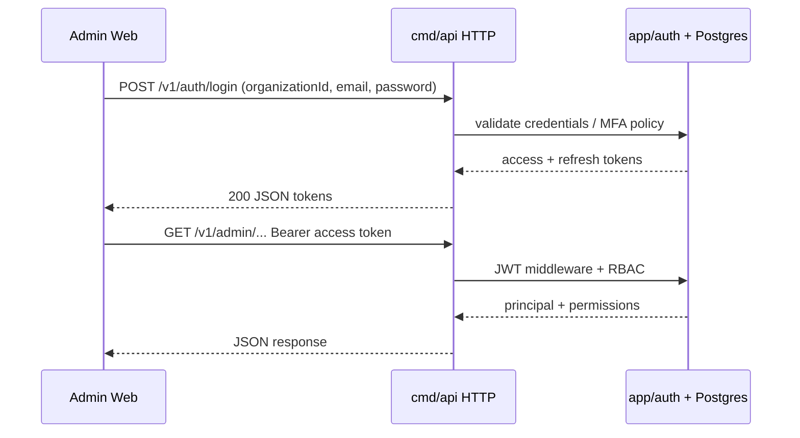
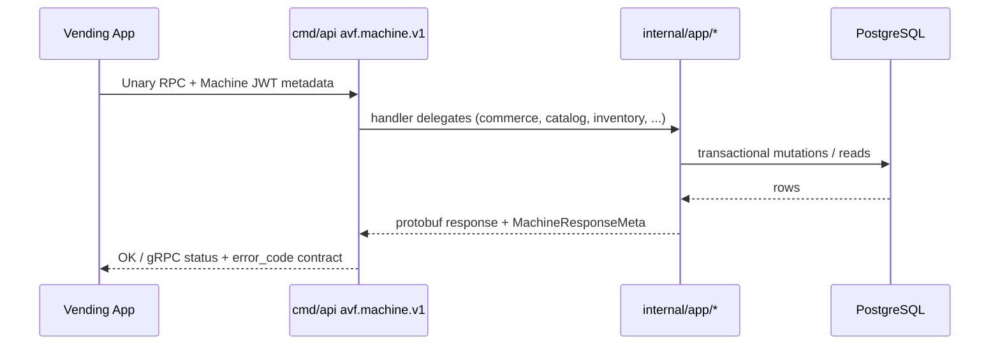
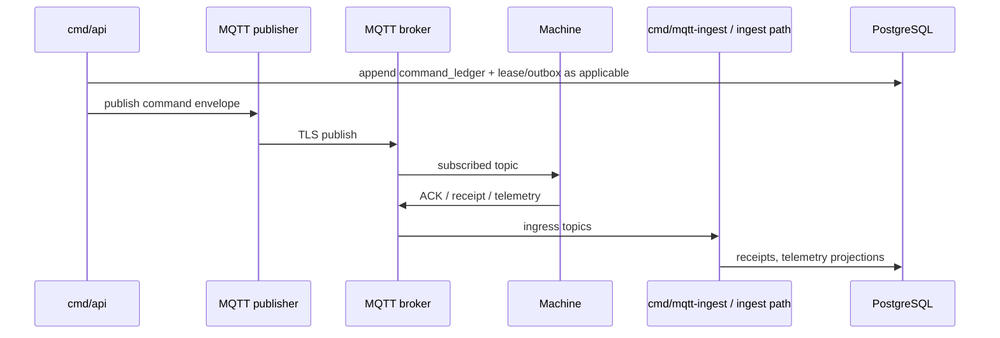
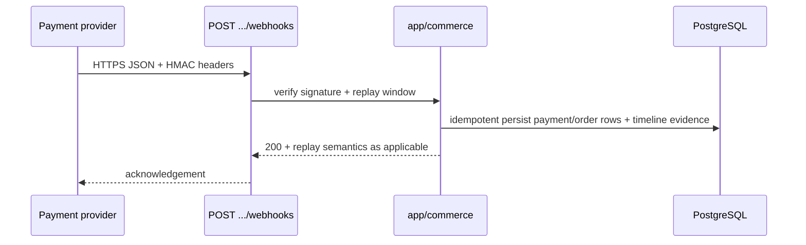

# Data flow overview

High-level sequences for the **implemented** transports. OpenAPI details live in **`docs/swagger/swagger.json`**; machine RPC contracts in **`proto/avf/machine/v1`**; MQTT shapes in **[`../api/mqtt-contract.md`](../api/mqtt-contract.md)**.

## Admin REST: login and Bearer session

User JWT issuance uses **`POST /v1/auth/login`** and **`POST /v1/auth/refresh`** (no Bearer on those routes). Subsequent **`/v1/*`** calls send **`Authorization: Bearer <access_token>`**. MFA and lockout policies are enforced in **`internal/app/auth`** and **`internal/config`** (see **[`../runbooks/configuration.md`](../runbooks/configuration.md)**).

## Machine runtime: gRPC (primary) vs legacy HTTP (deprecated)

**Primary:** **`avf.machine.v1`** with **Machine JWT** metadata (`authorization: Bearer …`). See **[`../api/machine-grpc.md`](../api/machine-grpc.md)**.

**Legacy:** Deprecated vending HTTP routes under `/v1/setup`, `/v1/commerce` (machine), `/v1/device`, etc., register only when **`ENABLE_LEGACY_MACHINE_HTTP=true`** (see `internal/httpserver/server.go`). Production should keep **`ENABLE_LEGACY_MACHINE_HTTP=false`** unless explicitly migrating. OpenAPI may still list paths for documentation; treat them as non-registered when the flag is off.

## Backend → machine commands (MQTT + ledger)

Commands append **command ledger** rows and publish to MQTT; devices ACK via MQTT (and receipts ingested). HTTP **`POST …/commands/poll`** is a **degraded legacy bridge**, not the primary delivery path.

## Payment webhook → order timeline

Provider callbacks use **HTTPS** + **HMAC** (no User JWT). Idempotency keys dedupe PSP retries; order timelines aggregate commerce events.

## Async outbox (NATS JetStream)

Transactional **`outbox_events`** rows are published by **`cmd/worker`** with retries, backoff, Postgres DLQ, and optional JetStream DLQ subject—see **[`../runbooks/outbox.md`](../runbooks/outbox.md)** and **[`../runbooks/outbox-dlq-debug.md`](../runbooks/outbox-dlq-debug.md)**.

## Related

- [`transport-boundary.md`](transport-boundary.md) — ownership matrix.
- [`current-architecture.md`](current-architecture.md) — process map and drift freeze.
- [`deployment-topology.md`](deployment-topology.md) — roles of nodes/services.
