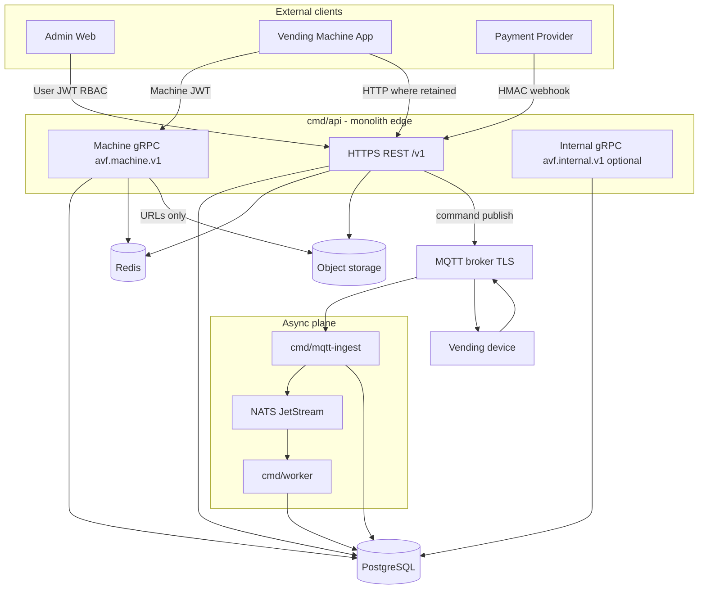

# Enterprise target model (transport and trust)

This document defines the **intended enterprise boundary model** for the AVF Vending backend in this repository. It complements the **as-built** freeze in [`current-architecture.md`](current-architecture.md) and the **north-star** narrative in [`target-architecture.md`](target-architecture.md). Use it when deciding where a feature belongs (REST vs gRPC vs MQTT vs async) and which credential applies.

**Phase P0.0 scope:** documentation only. Runtime behavior is described as **target** where it differs from today; see [`transport-boundary.md`](transport-boundary.md) for “today vs target” notes per transport.

---

## Client planes and primary transports

| Client / plane | Transport | Credential | Idempotency expectation |
| ---------------- | --------- | ---------- | ---------------------- |
| **Admin Web** | HTTPS REST + OpenAPI | **User JWT** + RBAC | Per route (headers/keys as documented) |
| **Vending Machine App** | **Native gRPC** (target) + HTTPS where HTTP remains | **Machine JWT** on gRPC; machine-scoped HTTP where applicable | Client offline queue + server dedupe keys |
| **Backend → machine (realtime)** | **MQTT over TLS** | Broker ACLs + device identity; command ledger in Postgres | Command sequence / receipt ACK |
| **Payment provider** | HTTPS REST webhook | **HMAC** (no User JWT) | Webhook idempotency + persistence |
| **Media** | **Object storage** + **HTTPS URLs** | Signed or public-read URLs per policy | Immutable object keys; app local cache |
| **Internal async** | **NATS / JetStream** (outbox, telemetry buffer) | Cluster credentials; not a public API | Durable consumers; poison handling |
| **System of record** | **PostgreSQL** | App DB credentials | Transactions; audit rows |
| **Cache / coordination** | **Redis** (when enabled) | Redis ACLs | TTL; not authoritative state |

---

## Repository mapping (where this lives today)

The codebase is a **modular monolith** with shared application services:

| Concern | Typical paths |
| ------- | ------------- |
| HTTP surface | `cmd/api`, `internal/httpserver`, `internal/bootstrap` |
| gRPC machine runtime (`avf.machine.v1`) | `internal/grpcserver`, `proto/avf/machine/v1/*.proto` |
| gRPC internal reads (`avf.internal.v1`) | `internal/grpcserver`, `proto/avf/internal/v1/*.proto` |
| MQTT | `cmd/mqtt-ingest`, `internal/platform/mqtt`, `internal/app/device` (publish path) |
| NATS / JetStream | `internal/platform/nats`, `cmd/worker`, ingest telemetry buffering |
| Application use cases | `internal/app/*` |
| Domain rules / compliance | `internal/domain/*` |
| Postgres access | `internal/modules/postgres`, `internal/gen/db`, `db/queries`, `migrations` |
| Object storage | `internal/platform/objectstore`, `internal/app/artifacts` (and catalog media patterns) |
| Auth | `internal/platform/auth` (JWT, RBAC, machine URL access) |

**Rule:** new capabilities should call into **`internal/app/*`** (and repositories) from thin adapters—HTTP handlers, gRPC handlers, MQTT consumers, workers—not reimplement business rules in each transport.

---

## Trust boundaries (non-negotiables)

1. **Admin REST** uses **User JWT** and **RBAC**. It must not become a thin wrapper around a **public** “admin gRPC” in P0.
2. **Machine runtime gRPC** (**`avf.machine.v1`**) uses **Machine JWT**, not admin/user tokens — shipped when **`MACHINE_GRPC_ENABLED=true`** (production requires explicit enablement).
3. **Payment webhooks** stay **REST**, **HMAC-verified**, and **idempotent** at persistence boundaries.
4. **Product/media binaries** are **not** gRPC payloads; gRPC returns **metadata + HTTPS URLs** only.
5. **MQTT** remains the **backend-to-machine command channel** in this phase; do not replace command delivery with gRPC streaming here.
6. **PostgreSQL** is the **source of truth** for transactional vending state; **Redis** is cache/session/rate/coordination only when wired.

---

## Relation to existing docs

- **Current process and transport reality:** [`current-architecture.md`](current-architecture.md)
- **North-star vs shipped:** [`target-architecture.md`](target-architecture.md)
- **Per-transport responsibilities and anti-patterns:** [`transport-boundary.md`](transport-boundary.md)
- **Phased implementation checklist:** [`p0-p1-p2-implementation-roadmap.md`](p0-p1-p2-implementation-roadmap.md)

---

## Diagram: high-level enterprise planes

This diagram matches the **implemented** split: **`avf.machine.v1`** is the native kiosk runtime when enabled; optional loopback **`avf.internal.v1`** remains read/query-only—see [`../api/machine-grpc.md`](../api/machine-grpc.md) and [`../api/internal-grpc.md`](../api/internal-grpc.md).
