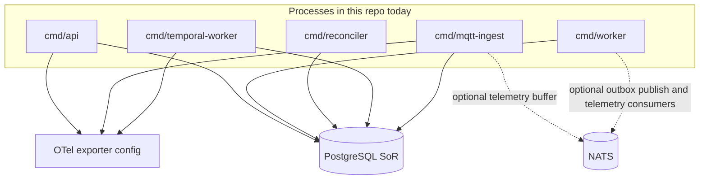
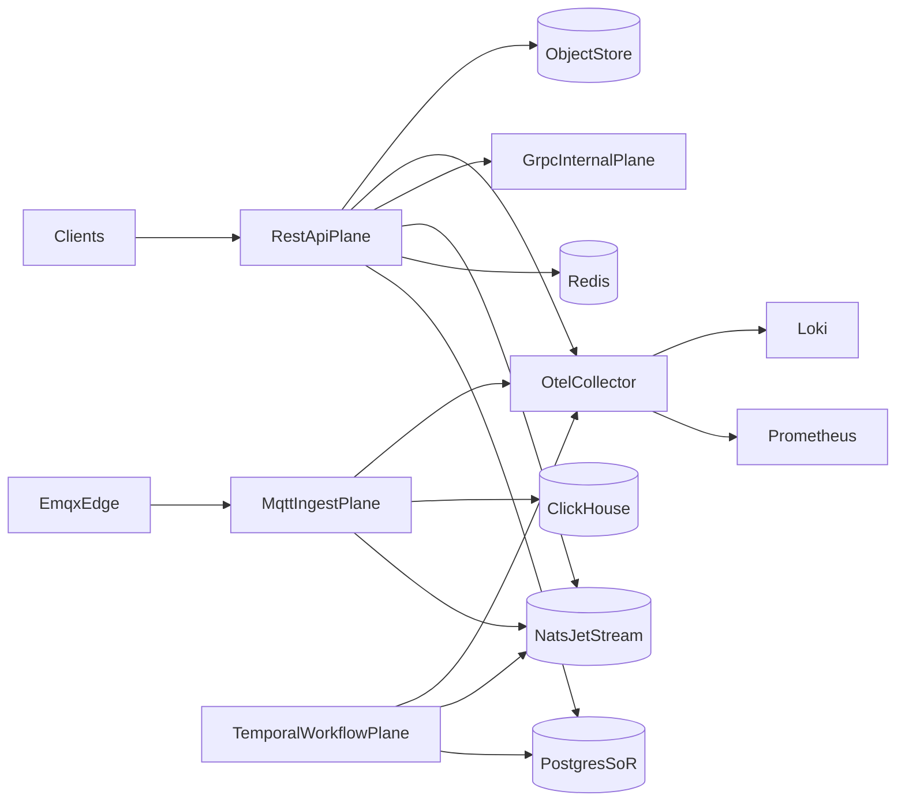
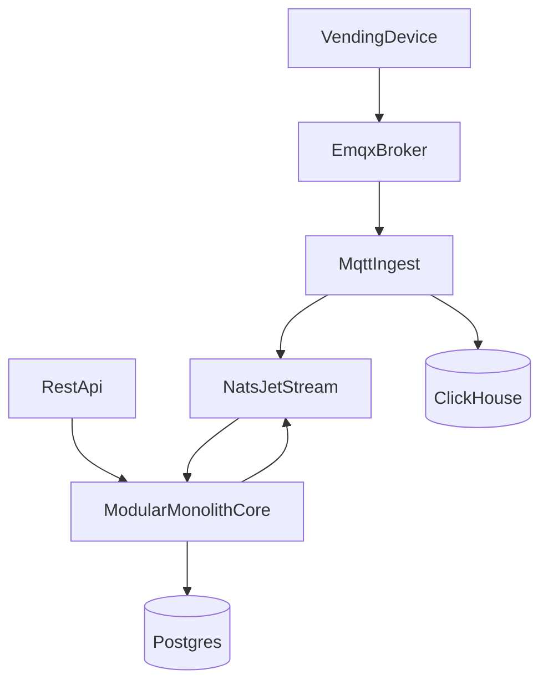

# Target architecture (AVF vending platform)

This document describes the **north-star** enterprise architecture for the AVF vending backend, then grounds it in **what this repository actually runs today**. The long-term direction is unchanged; the goal is to avoid confusing “designed for” with “shipped and on the critical path.”

For the concise **as-built freeze** used in this phase, see [`current-architecture.md`](current-architecture.md). That file is the canonical current-state summary; this document remains the target-state companion with a corrected reality check.

## How to read this document

| Layer | Purpose |
| ----- | ------- |
| **Current state** | What `main` can run with configuration and migrations you have in-tree. |
| **Follow-on** | Integration work that is **not** on the default critical path in `cmd/*` yet (may still exist as libraries or local-only services). |
| **Target state** | Full multi-plane system: internal RPC contracts, workflow engine, analytics sinks, hardened ops. |

Domain truths (all stages):

- **PostgreSQL** is the system of record for transactional vending state.
- **Redis is not** the system of record (cache / coordination only when used).
- **Payment success ≠ vend success**; **command publish success ≠ machine action success**—workflows and reconciliation exist to model those gaps honestly.

---

## Current state (repository reality)

**Processes** (`cmd/`):

- **`api`**: Chi HTTP server (liveness/readiness, optional Prometheus), JWT-backed **`/v1`** routes, application services from `internal/app/*`, Postgres via `internal/modules/postgres`. Optional **internal gRPC** listener when enabled: registers `grpc.health.v1` plus internal query/read services for machine, telemetry, and commerce state.
- **`worker`**: Scheduled **reliability** ticks (stuck payments/commands/orphan vends, outbox listing); **NATS JetStream** outbox publish **only when** `NATS_URL` (see `internal/platform/nats`) is set. When NATS is configured, the worker also runs **telemetry JetStream consumers** and retention work. Optional Temporal scheduling can enqueue payment-timeout follow-up when `TEMPORAL_SCHEDULE_PAYMENT_PENDING_TIMEOUT=true`.
- **`reconciler`**: Periodic **commerce reconciliation** (unresolved orders, payment probes, stuck vends, duplicate-payment hints, refund review lists). Default posture is still list/log-oriented, but **optional** payment probe + refund enqueue adapters are wired when `RECONCILER_ACTIONS_ENABLED=true`. Optional Temporal scheduling can enqueue refund/manual-review workflows on top of those reads.
- **`temporal-worker`**: Dedicated Temporal worker process that executes the registered long-running compensation/review workflows on the configured task queue.
- **`mqtt-ingest`**: MQTT subscriber → **JetStream telemetry buffers** (when `NATS_URL` is set) via `internal/app/telemetryapp`, then **`cmd/worker`** consumers project into Postgres (`machine_current_snapshot`, `telemetry_rollups`, incidents, receipts). Without NATS, ingest falls back to the legacy direct-`postgres.Store` hot path (see `ops/TELEMETRY_PIPELINE.md`).
- **`cli`**: Config validation and version.

**Application layer** (`internal/app/*`): Commerce, device, fleet, reliability, and API-facing surfaces are **real packages**; HTTP handlers stay thin and delegate here. Coverage of business scenarios is still **growing**—not every target-domain workflow has a full use-case implementation.

**Persistence** (`internal/modules/postgres`, `internal/gen/db`): Transactional patterns in use include order + vend session, payment + outbox, command ledger + desired shadow (+ optional outbox on the same transaction path), command receipts with dedupe, and MQTT ingest paths—aligned with **idempotent** keys and unique indexes in migrations.

**Platform libraries** (`internal/platform/*`):

- **NATS JetStream**: connection, streams, outbox publisher—**used** by `worker` when `NATS_URL` is set. The repo also uses JetStream for **telemetry buffering + worker-side telemetry consumers**. There is still **no in-repo consumer for worker-published outbox subjects**.
- **MQTT**: broker config, subscriber, routing into the store—**used** by `mqtt-ingest`.
- **Object storage (S3-compatible)**: used by **artifact** flows in `cmd/api` when `API_ARTIFACTS_ENABLED=true`; broader diagnostics / OTA usage is still follow-on work.
- **Temporal**: SDK client/worker helpers in `internal/platform/temporal`; `cmd/api`, `cmd/worker`, and `cmd/reconciler` may schedule selected workflows when enabled, and `cmd/temporal-worker` executes the registered workflows/activities.
- **ClickHouse** (`internal/platform/clickhouse`): optional **worker-side analytics mirror** for published outbox events when analytics flags are enabled; not a general telemetry analytics plane yet.
- **Redis / OpenTelemetry**: Config and clients as used by bootstrap and readiness—not a substitute for Postgres SoR.

**Observability**: OpenTelemetry hooks and standard health (and optional metrics) are wired from bootstrap where configured; Loki/Prometheus/Grafana stacks are **documented and sample-configured** under `ops/`—treat them as **deployment concerns**, not as “always running inside this Go binary.” **Incident response:** practical log fields, SQL, and alert ideas live in [`ops/RUNBOOK.md`](../../ops/RUNBOOK.md); worker/reconciler/MQTT are primarily **log-driven** until custom metrics exist ([`ops/METRICS.md`](../../ops/METRICS.md)).

## Current primary production deployment path

The current primary production deployment path for this repository is the split `2-VPS` layout under `deployments/prod/`:

- `app-node/`: stateless runtime app stack (`api`, `worker`, `reconciler`, `mqtt-ingest`, `caddy`, optional `temporal-worker`)
- `data-node/`: optional self-hosted broker/data-plane fallback (`nats`, `emqx`)
- `shared/`: shared edge config, env ownership docs, and release helpers

Managed dependencies are the current default posture for that active production path:

- PostgreSQL via `DATABASE_URL`
- Redis via `REDIS_URL` or `REDIS_ADDR` when enabled
- S3-compatible object storage via env when enabled
- only the broker-style fallback plane remains optionally self-hosted on `data-node/`

That interim production topology is still simpler than the north-star multi-plane target, but it already separates public app runtime concerns from the self-hosted broker plane. The old single-host compose path at `deployments/prod/docker-compose.prod.yml` is retained only as a legacy rollback option and should not be read as the primary target deployment model.

---

## Follow-on integration work (explicitly not default today)

Same modular-monolith layout; items below are **absent or incomplete** in `cmd/*` / `internal/app` wiring until implemented:

1. Extend **object storage** beyond the current artifact flows into OTA/diagnostic (or other) app paths.
2. Expand the **Temporal worker** beyond the current compensation/review workflows where durable orchestration adds value.
3. Add a **JetStream consumer** in-repo (or document an external consumer) for subjects produced by the worker outbox publisher.
4. Introduce a broader **ClickHouse-backed ingest** (or sidecar writer) when schemas and SLOs exist; today only the worker outbox mirror path is implemented.
5. Extend **internal gRPC** beyond the current query/read services when protobuf contracts for mutations or workflow boundaries are justified.

---

## Target state (north star)

**Not the deployed runtime:** the bullets and diagram below describe a **directional** multi-plane design. This repository ships a **single-region modular monolith** (`cmd/api` + satellite workers); there is **no** multi-region routing, active/active data plane, or Temporal worker fleet in-tree. Treat “advanced orchestration” language as **aspirational** unless a feature explicitly says it is implemented.

The system is organized into **separate runtime planes** with clear responsibilities:

- **Public REST API plane**: external/admin/mobile integrations, synchronous request/response (**shipped**: Chi `/v1` in `cmd/api`).
- **Internal gRPC plane (target)**: service-to-service protobuf contracts—**shipped today**: optional listener + `grpc.health.v1` + internal machine/telemetry/commerce query RPCs; broader domain RPC remains future work (`internal/grpcserver`).
- **MQTT / device connectivity plane**: EMQX (or compatible broker) at the edge; ingest processes translate device protocols into domain persistence and optional event fan-out (**shipped**: `cmd/mqtt-ingest` → Postgres).
- **Workflow plane (target)**: Temporal (or similar) for durable workflows (payouts, rollouts, incident response, refunds)—**partially shipped**: `cmd/temporal-worker` executes selected compensation/review workflows; broader workflow coverage remains future work.
- **Telemetry / events plane (target)**: high-volume machine telemetry into **ClickHouse**; operational logs into **Loki** (and metrics via Prometheus)—topology below; current Go code only ships an optional worker outbox mirror path to ClickHouse, not a full telemetry analytics plane.

## Primary data stores and messaging (target)

- **PostgreSQL**: system of record for transactional state (machines, orders, RBAC, commands, outbox, etc.).
- **Redis**: cache, locks, rate limits, ephemeral coordination when enabled.
- **NATS JetStream**: async buffering, fan-out, and backpressure—already used for worker publish/DLQ and telemetry buffering/consumption when `NATS_URL` is set; **no in-repo consumer for worker outbox subjects** yet.
- **ClickHouse**: high-volume machine events, telemetry, forensic analytics—**target primary sink**; current runtime only includes an optional worker outbox mirror path.
- **S3-compatible object storage (MinIO/S3)**: already used for artifacts; OTA bundles and broader diagnostic flows still land incrementally.

## Request and event flow (target, conceptual)

Concrete topic names and schemas evolve with feature work. **Today**, MQTT ingest can buffer through NATS JetStream before worker-side projection into Postgres, while ClickHouse remains a target-state analytics path rather than the default telemetry sink.

## Observability (target + today)

- **OpenTelemetry** for traces/metrics/logs correlation at the application boundary—**wired** from bootstrap where configured.
- **Prometheus + Alertmanager + Grafana** for SLOs, alerting, and dashboards—**sample configs** under `ops/`.
- **Loki** for centralized logs—**sample configs** under `ops/`.

The **API process** exposes standard health endpoints and optional Prometheus scraping behind explicit configuration.
