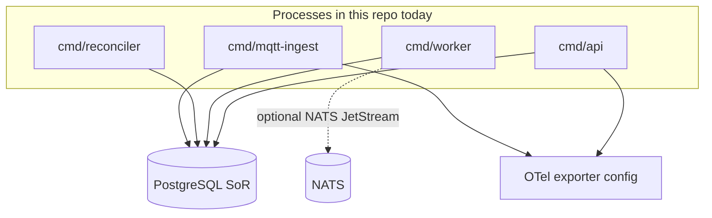
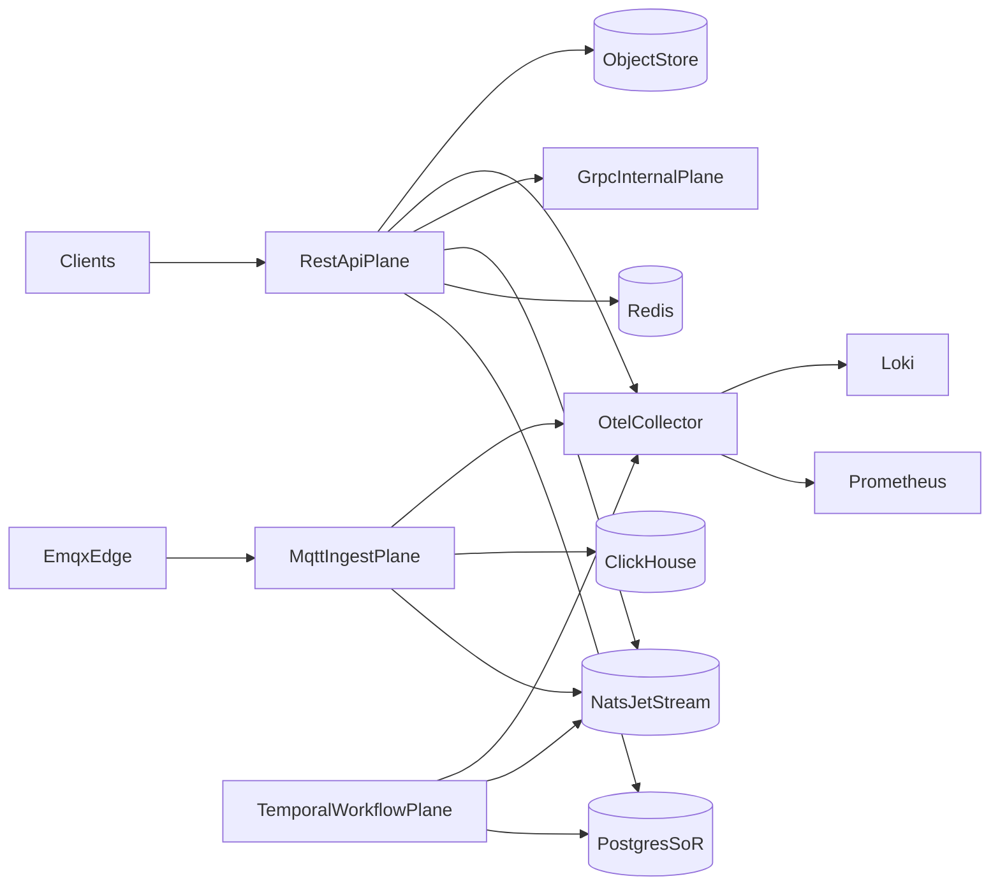
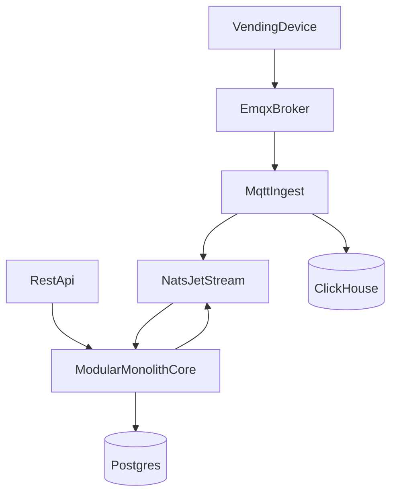

# Target architecture (AVF vending platform)

This document describes the **north-star** enterprise architecture for the AVF vending backend, then grounds it in **what this repository actually runs today**. The long-term direction is unchanged; the goal is to avoid confusing “designed for” with “shipped and on the critical path.”

## How to read this document

| Layer | Purpose |
| ----- | ------- |
| **Current state** | What `main` can run with configuration and migrations you have in-tree. |
| **Follow-on** | Integration work that is **not** on the default critical path in `cmd/*` yet (may still exist as libraries or local-only services). |
| **Target state** | Full multi-plane system: internal RPC contracts, workflow engine, analytics sinks, hardened ops. |

Domain truths (all stages):

- **PostgreSQL** is the system of record for transactional vending state.
- **Redis is not** the system of record (cache / coordination only when used).
- **Payment success ≠ vend success**; **command publish success ≠ machine action success**—workflows and reconciliation exist to model those gaps honestly.

---

## Current state (repository reality)

**Processes** (`cmd/`):

- **`api`**: Chi HTTP server (liveness/readiness, optional Prometheus), JWT-backed **`/v1`** routes, application services from `internal/app/*`, Postgres via `internal/modules/postgres`. Optional **internal gRPC** listener when enabled: registers **`grpc.health.v1` only**—no generated domain protobuf services are mounted yet.
- **`worker`**: Scheduled **reliability** ticks (stuck payments/commands/orphan vends, outbox listing); **NATS JetStream** outbox publish **only when** `NATS_URL` (see `internal/platform/nats`) is set—otherwise outbox rows stay unpublished from the broker’s perspective.
- **`reconciler`**: Periodic **commerce reconciliation reads** (unresolved orders, payment probes, stuck vends, duplicate-payment hints, refund review lists). **Payment gateway / refund execution** dependencies are still **nil** in wiring—detection and logging, not automated PSP action.
- **`mqtt-ingest`**: MQTT subscriber → **JetStream telemetry buffers** (when `NATS_URL` is set) via `internal/app/telemetryapp`, then **`cmd/worker`** consumers project into Postgres (`machine_current_snapshot`, `telemetry_rollups`, incidents, receipts). Without NATS, ingest falls back to the legacy direct-`postgres.Store` hot path (see `ops/TELEMETRY_PIPELINE.md`).
- **`cli`**: Config validation and version.

**Application layer** (`internal/app/*`): Commerce, device, fleet, reliability, and API-facing surfaces are **real packages**; HTTP handlers stay thin and delegate here. Coverage of business scenarios is still **growing**—not every target-domain workflow has a full use-case implementation.

**Persistence** (`internal/modules/postgres`, `internal/gen/db`): Transactional patterns in use include order + vend session, payment + outbox, command ledger + desired shadow (+ optional outbox on the same transaction path), command receipts with dedupe, and MQTT ingest paths—aligned with **idempotent** keys and unique indexes in migrations.

**Platform libraries** (`internal/platform/*`):

- **NATS JetStream**: connection, streams, outbox publisher—**used** by `worker` when `NATS_URL` is set. **Publish-side only** in this repo: consumer helpers live under `internal/platform/nats`, but no `cmd/*` process subscribes to outbox subjects here yet.
- **MQTT**: broker config, subscriber, routing into the store—**used** by `mqtt-ingest`.
- **Object storage (S3-compatible)**: **Client library** in `internal/platform/objectstore` (config, put/get, presigns, key helpers)—**not imported** from `internal/app` or `cmd/*` yet, so no runtime blob path from the API/worker processes.
- **Temporal**: **Thin SDK wrapper** (dial, worker constructor) in `internal/platform/temporal`; **no** `cmd/*` dials the server or registers workflows/activities.
- **ClickHouse** (`internal/platform/clickhouse`): **Future analytics sink** — **partial foundation** only (`Open` → noop when disabled; **fail-fast** when `Enabled=true`). **No** writes, queries, or bootstrap wiring in this repo today.
- **Redis / OpenTelemetry**: Config and clients as used by bootstrap and readiness—not a substitute for Postgres SoR.

**Observability**: OpenTelemetry hooks and standard health (and optional metrics) are wired from bootstrap where configured; Loki/Prometheus/Grafana stacks are **documented and sample-configured** under `ops/`—treat them as **deployment concerns**, not as “always running inside this Go binary.” **Incident response:** practical log fields, SQL, and alert ideas live in [`ops/RUNBOOK.md`](../../ops/RUNBOOK.md); worker/reconciler/MQTT are primarily **log-driven** until custom metrics exist ([`ops/METRICS.md`](../../ops/METRICS.md)).

---

## Follow-on integration work (explicitly not default today)

Same modular-monolith layout; items below are **absent or incomplete** in `cmd/*` / `internal/app` wiring until implemented:

1. Wire **object storage** into OTA/diagnostic (or other) flows using `internal/platform/objectstore` from app/bootstrap.
2. Run a **Temporal worker** process and register workflows/activities via `internal/platform/temporal`.
3. Add a **JetStream consumer** in-repo (or document an external consumer) for subjects produced by the worker outbox publisher.
4. Introduce a **ClickHouse-backed ingest** (or sidecar writer) when schemas and SLOs exist; extend `internal/platform/clickhouse` with a real `Client` implementation and explicit async boundaries—today the package is placeholder-only.
5. Add **domain gRPC** services when protobuf contracts exist; `internal/grpcserver` remains health-only + registrar hook.

---

## Target state (north star)

**Not the deployed runtime:** the bullets and diagram below describe a **directional** multi-plane design. This repository ships a **single-region modular monolith** (`cmd/api` + satellite workers); there is **no** multi-region routing, active/active data plane, or Temporal worker fleet in-tree. Treat “advanced orchestration” language as **aspirational** unless a feature explicitly says it is implemented.

The system is organized into **separate runtime planes** with clear responsibilities:

- **Public REST API plane**: external/admin/mobile integrations, synchronous request/response (**shipped**: Chi `/v1` in `cmd/api`).
- **Internal gRPC plane (target)**: service-to-service protobuf contracts—**shipped today**: optional listener + **grpc.health.v1 only**; domain RPC is future work (`internal/grpcserver`).
- **MQTT / device connectivity plane**: EMQX (or compatible broker) at the edge; ingest processes translate device protocols into domain persistence and optional event fan-out (**shipped**: `cmd/mqtt-ingest` → Postgres).
- **Workflow plane (target)**: Temporal (or similar) for durable workflows (payouts, rollouts, incident response, refunds)—**not shipped**: SDK wrapper only in `internal/platform/temporal`, no worker process.
- **Telemetry / events plane (target)**: high-volume machine telemetry into **ClickHouse**; operational logs into **Loki** (and metrics via Prometheus)—topology below; ClickHouse path is placeholder-only in Go today.

## Primary data stores and messaging (target)

- **PostgreSQL**: system of record for transactional state (machines, orders, RBAC, commands, outbox, etc.).
- **Redis**: cache, locks, rate limits, ephemeral coordination when enabled.
- **NATS JetStream**: async buffering, fan-out, and backpressure—**publish path adopted** from `worker` when `NATS_URL` is set; **no in-repo consumer** process yet.
- **ClickHouse**: high-volume machine events, telemetry, forensic analytics—**target only**; the Go `clickhouse` package does not implement ingestion and is not on the runtime path.
- **S3-compatible object storage (MinIO/S3)**: artifacts, OTA bundles, diagnostic uploads—**library ready**; end-to-end product flows still land incrementally.

## Request and event flow (target, conceptual)

Concrete topic names and schemas evolve with feature work. **Today**, MQTT ingest persists to Postgres; the path **through NATS and ClickHouse** in this diagram is **target**, not guaranteed for every message.

## Observability (target + today)

- **OpenTelemetry** for traces/metrics/logs correlation at the application boundary—**wired** from bootstrap where configured.
- **Prometheus + Alertmanager + Grafana** for SLOs, alerting, and dashboards—**sample configs** under `ops/`.
- **Loki** for centralized logs—**sample configs** under `ops/`.

The **API process** exposes standard health endpoints and optional Prometheus scraping behind explicit configuration.
