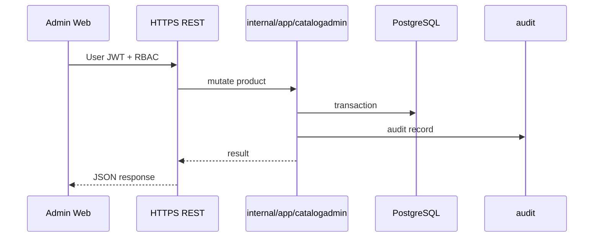
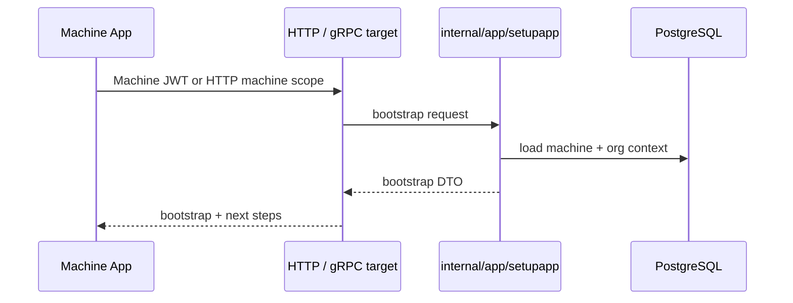
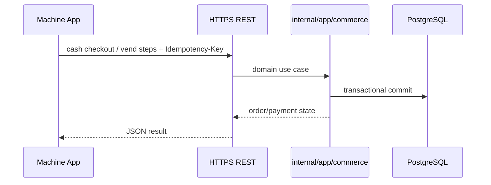
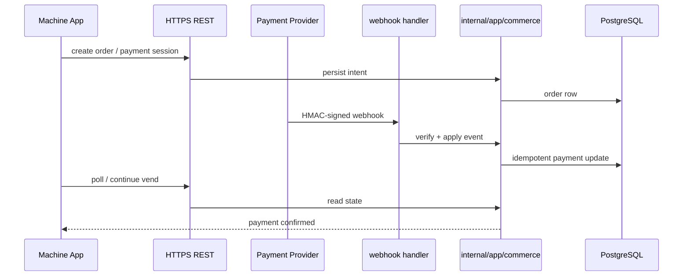
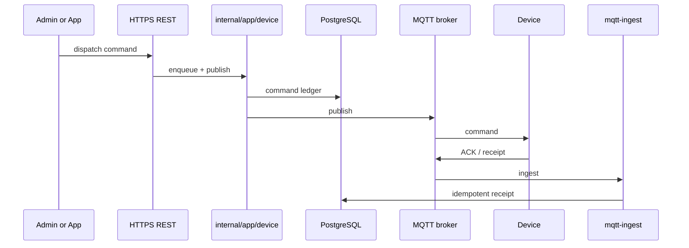
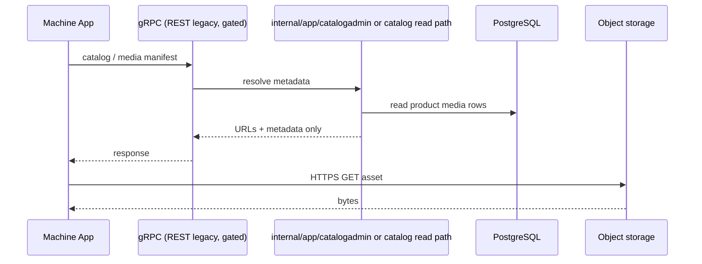

# Transport boundary specification

This document is the **single reference** for what each transport **owns**, what it **must not** do, and how flows map across planes. It aligns implementation with the enterprise model in [`enterprise-target-model.md`](enterprise-target-model.md).

**Phase P0.1:** runtime validation and route guards enforce the split (see **Runtime enforcement** at the end of this document and `internal/config/deployment_env.go`).

---

## 1. REST Admin API

### Responsibility

- **Operator and administrator** workflows: catalog, pricing, promotions, fleet, inventory, reporting, RBAC user admin, finance/audit reads, feature flags, OTA admin, etc. (concrete routes live under `/v1/admin/*` and related prefixes; inventory of many paths is summarized in `internal/httpserver/router.go` comments).
- **OpenAPI** as the contract for external integrators on this surface (`docs/swagger/swagger.json`, generated via `make swagger`).
- **User JWT** authentication and **RBAC** (`internal/platform/auth`).

### Must not

- Serve as a **machine-native** primary API for high-frequency vend/runtime (target: gRPC for that plane).
- Accept **payment webhooks** without **HMAC** and idempotent persistence (webhook routes are separate; see §5).
- **Duplicate** business logic that already exists in `internal/app/*`—handlers delegate to application services.

### Today vs target

- **Today:** Admin and many machine-adjacent flows correctly use HTTP; internal gRPC exists for **read/query** only and is **not** the Admin Web API.
- **Target:** Admin Web **remains REST** in P0/P1; **do not** expose internal gRPC as a public Admin API.

---

## 2. Machine gRPC (target runtime plane)

### Responsibility (target)

- **Vending Machine App** integration: structured RPCs for activation state, catalog/sale surface, commerce steps, telemetry submission, command status polling, and other runtime operations that benefit from protobuf + streaming constraints **without** carrying media bytes.
- **Machine JWT** for authenticated machine identity (see `internal/platform/auth` evolution—claims and issuance must match machine provisioning, not admin users).
- **Idempotency**: duplicate client retries must resolve to the same logical outcome using keys already modeled in Postgres (patterns in commerce, commands, telemetry).

### Must not

- Replace **Admin REST** for back-office users in P0.
- Carry **product image or binary media**; return **metadata + HTTPS URLs** only (object storage or CDN).
- **Bypass** `internal/app/*` for mutations—gRPC handlers are thin adapters.

### Today vs target

- **Public machine gRPC:** `MACHINE_GRPC_ENABLED=true` (or legacy `GRPC_ENABLED=true`) exposes `avf.machine.v1` runtime services authenticated with **Machine JWT**. The single-file import anchor for clients and docs is `proto/avf/machine/v1/machine_runtime.proto` (see also [`../api/machine-grpc.md`](../api/machine-grpc.md)). Production requires **`MACHINE_GRPC_ENABLED=true` explicitly** — see **Runtime enforcement** at the end of this document.
- **Internal split-ready gRPC:** `INTERNAL_GRPC_ENABLED` exposes loopback `avf.internal.v1` read-only query services (`InternalMachineQueryService`, `InternalTelemetryQueryService`, `InternalCommerceQueryService`, `InternalPaymentQueryService`, `InternalCatalogQueryService`, `InternalInventoryQueryService`, `InternalReportingQueryService`) with service JWT—see [`../api/internal-grpc.md`](../api/internal-grpc.md). This does **not** split the monolith or replace Admin REST.

---

## 3. MQTT (backend ↔ machine realtime)

### Responsibility

- **Ingress:** device telemetry, vend results, command ACKs, and other device-published envelopes per [`../api/mqtt-contract.md`](../api/mqtt-contract.md).
- **Egress:** backend-published **commands** to devices; **command ledger** and **receipt** persistence in PostgreSQL for auditability and idempotency.
- **TLS** to broker; configuration under `internal/platform/mqtt` and deployment docs.

### Must not

- Be **removed** as the command delivery channel in favor of gRPC streaming **in this phase** (per program constraints).
- Implement **business rules** duplicated from `internal/app/*`—ingest handlers translate to app/repository calls.

### Interaction with NATS

- When `NATS_URL` is set, telemetry may **buffer through JetStream** before worker-side projection (`cmd/mqtt-ingest`, `cmd/worker`)—see [`current-architecture.md`](current-architecture.md).

---

## 4. REST payment webhook

### Responsibility

- **Provider → backend** callbacks on **HTTPS REST** only for this contract surface.
- **HMAC** verification and **replay-safe** handling (`internal/httpserver/commerce_webhook_*`, `internal/modules/postgres/commerce_webhook.go`).
- Persist outcomes **idempotently**; align with commerce/order state in Postgres.

### Must not

- Use **User JWT** for provider delivery (provider uses shared secret / HMAC).
- Move webhook delivery to gRPC for external PSPs unless explicitly replanned as a separate enterprise decision.

---

## 5. Object storage / media

### Responsibility

- **Durable binaries** (images, artifacts, future OTA blobs) in **S3-compatible** storage (`internal/platform/objectstore`, `internal/app/artifacts`, catalog media flows).
- **HTTPS URLs** (signed or policy-based) returned to clients; **local cache** on the vending app.

### Must not

- Stream raw media through **gRPC** message fields as the primary delivery path.

---

## 6. NATS / JetStream / outbox

### Responsibility

- **Durable async**: telemetry buffering, worker consumers, optional **outbox publish** from transactions (`internal/app/reliability`, `internal/platform/nats`).
- **Internal** integration—not a public REST contract.

### Must not

- Become a shortcut for **skipping Postgres** as SoR for transactional outcomes.
- Bypass existing **outbox and backoff** abstractions when extending publish behavior.

---

## 7. PostgreSQL and Redis

### PostgreSQL

- **System of record**: orders, payments, commands, inventory ledger, RBAC, audit events, feature flags, fleet state, etc.
- Migrations under `migrations/`; queries under `db/queries/`; sqlc output in `internal/gen/db/`; repositories in `internal/modules/postgres/`.
- **Mandatory auditability** for writes: enterprise audit tables and hooks evolve with features (`internal/app/audit`, related HTTP).

### Redis

- **Non-authoritative**: cache, rate limits, sessions, coordination when enabled (`internal/platform/redis`, `internal/platform/ratelimit`).
- Must not be the only copy of **financial or vend** truth.

---

## 8. What must not happen (summary)

| Anti-pattern | Why |
| ------------ | --- |
| gRPC for Admin Web in P0 | Breaks OpenAPI-first admin integrations and blurs RBAC/credential model |
| gRPC for media binary transfer | Payload size, caching, CDN alignment; use HTTPS + object store |
| Remove MQTT command delivery | Realtime edge contract and broker ACL model; phased program says keep |
| Duplicate business logic across transports | Drift, inconsistent idempotency, audit gaps |
| Expose internal query gRPC as public admin API | Wrong trust boundary and operational exposure |

---

## Sequence-style flows (textual)

### A. Admin product CRUD

1. Admin Web authenticates with **User JWT**; RBAC allows catalog mutations.
2. `POST/PATCH/DELETE /v1/admin/...` (catalog routes) hit `internal/httpserver` → `internal/app/catalogadmin` (or related).
3. Service validates input, writes **Postgres** in a transaction; **audit** event recorded where required.
4. Optional: outbox/NATS fan-out for downstream indexing—**not** a substitute for committed DB state.
5. Media uploads use **object storage** + URL references; **not** large JSON bodies on admin REST long-term (follow existing catalog media patterns).

### B. Machine activation / bootstrap

1. Machine or technician flow obtains credentials per activation handoff ([`../api/machine-activation-implementation-handoff.md`](../api/machine-activation-implementation-handoff.md)).
2. **Today:** HTTP `GET /v1/setup/machines/{machineId}/bootstrap` (machine-scoped access) returns bootstrap payload.
3. **Target:** equivalent **gRPC** may return the same **logical** data using **Machine JWT**; implementation must reuse `internal/app/setupapp` (or successor) services.
4. Postgres holds activation/machine rows; idempotent retries safe where keys exist.

### C. Machine sale — cash

1. Operator session / machine initiates **cash** checkout on device.
2. **HTTP today:** commerce routes under `/v1/commerce/*` and device bridge routes (see `router.go`); cash-specific behavior per [`../api/cash-settlement.md`](../api/cash-settlement.md) and kiosk flow docs.
3. App services update **order + payment + vend** state in **Postgres** with **idempotency keys** on mutating calls.
4. Telemetry and optional MQTT events reflect vend outcome; **SoR remains Postgres**.

### D. Machine sale — QR / electronic payment

1. Machine creates or resumes order; payment session with provider.
2. Provider calls **REST webhook** with **HMAC**; handler verifies and persists **idempotently**.
3. Machine polls or receives push per integration; **vend** transitions still go through commerce services.
4. No **Admin JWT** on webhook path; commerce state in **Postgres**.

### E. MQTT command dispatch / ACK

1. Backend creates **command** row (ledger) in **Postgres**; may publish to MQTT via `internal/app/device` publisher from API when configured.
2. Device receives command, executes, publishes **ACK** / receipt on contract topic.
3. `cmd/mqtt-ingest` consumes, applies **idempotent** ingest to command receipt / telemetry stores.
4. Admin or machine may query status via HTTP **today** (`/v1/machines/{machineId}/commands/...`); **target gRPC** may mirror read models using app services.

### F. Media sync

1. Admin or pipeline uploads media to **object storage**; Postgres stores **metadata + URL/key**.
2. Machine app requests **catalog or media manifest** via **gRPC in production**; **legacy REST** for the same surfaces exists only when **`ENABLE_LEGACY_MACHINE_HTTP=true`**. Responses include **HTTPS URLs** and cache headers / ETags as applicable.
3. App downloads **directly from object storage or CDN**, not via gRPC byte streams.

---

## Runtime enforcement (P0.1)

| Concern | Mechanism |
| ------- | --------- |
| Machine gRPC required in production | `MACHINE_GRPC_ENABLED=true` is mandatory when `APP_ENV=production` (using `GRPC_ENABLED` alone does not satisfy validation). |
| Legacy machine REST | **`ENABLE_LEGACY_MACHINE_HTTP`** (canonical) defaults **off** in production; **`MACHINE_REST_LEGACY_ENABLED`** is a deprecated alias when `ENABLE_*` is unset. Enabling legacy in production additionally requires **`MACHINE_REST_LEGACY_ALLOW_IN_PRODUCTION=true`**. When disabled, legacy **vending** routes are **not registered** on `/v1` (404 at router); public payment webhooks and admin REST are unaffected. |
| Machine JWT vs user JWT | **HTTP:** `/v1/admin/*` uses `RequireDenyMachinePrincipal` — machine-role tokens receive `403`. **gRPC:** `avf.machine.v1` RPCs require Machine JWT; `unaryInternalUserAuth` rejects the `avf.machine.v1` namespace if a bug would route user credentials there. |
| gRPC idempotency ledger | `GRPC_REQUIRE_IDEMPOTENCY=true` (default) keeps the Postgres-backed replay interceptor enabled. |
| MQTT command path | `MQTT_COMMAND_TRANSPORT` must be `mqtt` in production. Admin/operator command **dispatch** (`POST .../commands/dispatch`) remains on Admin REST and uses the command ledger + MQTT publish path (not gated as legacy machine runtime). |

### Configuration reference (abbreviated)

| Variable | Role |
| -------- | ---- |
| `MACHINE_GRPC_ENABLED` | Enables the machine gRPC listener (`GRPC_ADDR`). Merged with legacy `GRPC_ENABLED` for backward compatibility, but production requires an explicit `MACHINE_GRPC_ENABLED=true`. |
| `GRPC_REQUIRE_MACHINE_JWT` | Alias precedence over `GRPC_REQUIRE_MACHINE_AUTH`; requires Machine JWT on protected machine RPCs. |
| `GRPC_REQUIRE_IDEMPOTENCY` | Gates the unary idempotency/replay interceptor. |
| `ENABLE_LEGACY_MACHINE_HTTP` | **Canonical** switch for deprecated vending machine REST under `/v1` (bootstrap GET, sale-catalog HTTP, telemetry reads, shadow, device bridge, operator HTTP sessions, commerce HTTP). Defaults **on** outside production, **off** in production unless set true with allow flag. |
| `MACHINE_REST_LEGACY_ENABLED` | Deprecated alias: read only when **`ENABLE_LEGACY_MACHINE_HTTP` is not set** in the environment. |
| `MACHINE_REST_LEGACY_ALLOW_IN_PRODUCTION` | Explicit escape hatch when enabling legacy REST in production. |
| `MQTT_COMMAND_TRANSPORT` | Documents/enforces MQTT as the command transport (default `mqtt`). |

---

## Related operational docs

- MQTT: [`../api/mqtt-contract.md`](../api/mqtt-contract.md)
- Machine runtime HTTP (legacy / gated): [`../api/machine-runtime.md`](../api/machine-runtime.md)
- Payment webhook security: [`../api/payment-webhook-security.md`](../api/payment-webhook-security.md)
- Internal gRPC (today): [`../api/internal-grpc.md`](../api/internal-grpc.md)
