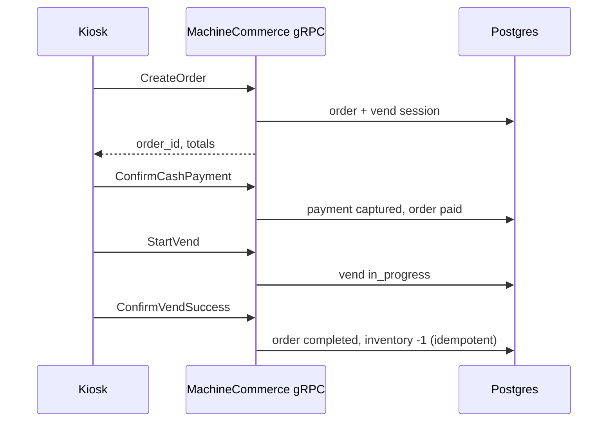
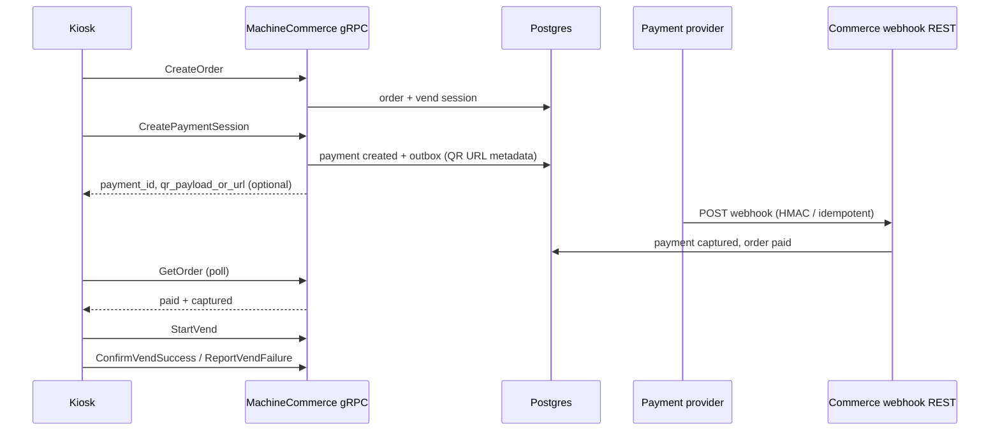

# Local gRPC testing (cmd/api)

The API process can expose a **gRPC** listener alongside HTTP when **`MACHINE_GRPC_ENABLED=true`** or **`GRPC_ENABLED=true`** (same listener wiring — production **`APP_ENV=production`** requires **`MACHINE_GRPC_ENABLED=true`** explicitly). This complements:

- **Internal** query services (`avf.v1`) — Bearer **user/service** JWT (same material as admin HTTP).
- **Machine** lifecycle services (`avf.machine.v1`) — **public** activation/refresh RPCs (no Bearer), and **protected** bootstrap, **sale catalog**, **inventory** (snapshot / restock / adjustment), and **operator session heartbeat** RPCs that require a **machine access** JWT (`typ=machine`, `aud=avf-machine-grpc`). Catalog RPCs return **HTTPS image URLs and checksum metadata only** (no image bytes). Inventory writes require an **idempotency key** (gRPC metadata `x-idempotency-key` or `idempotency-key`, and/or `IdempotencyContext.idempotency_key` — they must match if both are set), plus `client_event_id` and `client_created_at` on `IdempotencyContext`. Retries under the same idempotency key must repeat the **same** `client_event_id` and line items: the ledger hashes these into `idempotency_payload_sha256`, and a different payload returns `ABORTED` (`idempotency key conflict`).

## Environment

| Variable | Default (when `GRPC_ENABLED=true`) | Notes |
| -------- | ------------------------------------ | ----- |
| `GRPC_ENABLED` | `false` | Set `true` to listen. |
| `GRPC_ADDR` | `:9090` | Bind address (use `127.0.0.1:9090` locally if needed). |
| `GRPC_SHUTDOWN_TIMEOUT` | `15s` | Graceful stop budget. |
| `GRPC_HEALTH_ENABLED` | `true` | Registers `grpc.health.v1`. |
| `GRPC_REFLECTION_ENABLED` | `true` in `development` / `test`, else follows explicit env | **Must be `false` in production** (`APP_ENV=production` validation rejects reflection on). |
| `GRPC_REQUIRE_MACHINE_AUTH` | `true` | Requires Machine JWT on protected `avf.machine.v1` RPCs. Activation and refresh stay public because their credentials are in the request body. |
| `GRPC_UNARY_HANDLER_TIMEOUT` | `60s` | Applied when the client does not send a deadline. |
| `GRPC_PUBLIC_BASE_URL` | (empty) | Advertised URI for vending apps (`grpcs://machine-api.example.com:443`). Required when **production** exposes machine gRPC. |
| `GRPC_BEHIND_TLS_PROXY` | `false` | TLS terminates at reverse proxy; mutual exclusion with `GRPC_TLS_ENABLED`. |
| `GRPC_MAX_RECV_MSG_SIZE` | `0` | Max inbound bytes (`grpc.Server`); `0` uses library default (~4 MiB). |
| `GRPC_MAX_SEND_MSG_SIZE` | `0` | Max outbound bytes; `0` uses library default. |

JWT validation for **internal** gRPC (`/avf.v1.*`) uses the same `HTTP_AUTH_*` settings as HTTP admin routes.

Machine access tokens are **HS256**-signed with the same secrets as `SessionIssuer` (`JWT_SECRET` / `LOGIN_JWT_SECRET` rotation keys). RS256/JWKS modes apply to **user** tokens on internal gRPC, not to machine HS256 verification on the machine bootstrap path.

## Run the API

From the repository root (with Postgres/NATS/etc. as required by your stack):

```powershell
$env:GRPC_ENABLED = "true"
$env:GRPC_ADDR = "127.0.0.1:9090"
go run ./cmd/api
```

## grpcurl examples

List services (requires **reflection** enabled — default in development):

```bash
grpcurl -plaintext localhost:9090 list
```

Health check (no `Authorization` header):

```bash
grpcurl -plaintext localhost:9090 grpc.health.v1.Health/Check
```

**Claim activation** (public — no Bearer; body carries the code and device fingerprint):

```bash
grpcurl -plaintext -d "{\"activation_code\":\"AVF-XXXXXX-XXXXXX\",\"device_fingerprint\":{\"serial_number\":\"SN-1\",\"android_id\":\"dev-1\"}}" \
  localhost:9090 avf.machine.v1.MachineActivationService/ClaimActivation
```

**Refresh machine session** (public — refresh token in body):

```bash
grpcurl -plaintext -d "{\"refresh_token\":\"<refresh_token_from_claim>\"}" \
  localhost:9090 avf.machine.v1.MachineTokenService/RefreshMachineToken
```

The same public activation and refresh methods are also available under `avf.machine.v1.MachineAuthService` for clients that prefer one auth service namespace; those requests wrap the same payload under `claim` or `refresh`.

**Get bootstrap** (requires `Authorization: Bearer <machine_access_jwt>`):

```bash
grpcurl -plaintext -H "authorization: Bearer <machine_access_jwt>" -d "{}" \
  localhost:9090 avf.machine.v1.MachineBootstrapService/GetBootstrap
```

**Check for updates** (same Bearer as bootstrap):

```bash
grpcurl -plaintext -H "authorization: Bearer <machine_access_jwt>" \
  -d "{\"catalog_fingerprint\":\"\",\"pricing_fingerprint\":\"\",\"planogram_fingerprint\":\"\",\"media_fingerprint\":\"\"}" \
  localhost:9090 avf.machine.v1.MachineBootstrapService/CheckForUpdates
```

**Sale catalog snapshot** (Machine JWT; optional `machine_id` must match the token’s machine):

```bash
grpcurl -plaintext -H "authorization: Bearer <machine_access_jwt>" -d "{}" \
  localhost:9090 avf.machine.v1.MachineCatalogService/GetCatalogSnapshot
```

**Media manifest** (primary display URLs + checksum/etag per product; still no binary):

```bash
grpcurl -plaintext -H "authorization: Bearer <machine_access_jwt>" -d "{\"include_unavailable\":false}" \
  localhost:9090 avf.machine.v1.MachineCatalogService/GetMediaManifest
```

Dedicated media namespace (same metadata-only response):

```bash
grpcurl -plaintext -H "authorization: Bearer <machine_access_jwt>" -d "{\"include_unavailable\":false}" \
  localhost:9090 avf.machine.v1.MachineMediaService/GetMediaManifest
```

**Media delta** (reserved — returns `UNIMPLEMENTED`; use the full manifest and `media_fingerprint` for now):

```bash
grpcurl -plaintext -H "authorization: Bearer <machine_access_jwt>" -d "{}" \
  localhost:9090 avf.machine.v1.MachineMediaService/GetMediaDelta
```

**Catalog delta** (reserved — returns `UNIMPLEMENTED`; use snapshot + `catalog_version` / `config_version`):

```bash
grpcurl -plaintext -H "authorization: Bearer <machine_access_jwt>" -d "{}" \
  localhost:9090 avf.machine.v1.MachineCatalogService/GetCatalogDelta
```

**Inventory snapshot** (Machine JWT; `machine_id` is always the token’s machine):

```bash
grpcurl -plaintext -H "authorization: Bearer <machine_access_jwt>" -d "{}" \
  localhost:9090 avf.machine.v1.MachineInventoryService/GetInventorySnapshot
```

**Planogram view** (Machine JWT; optional `machine_id` must match the token):

```bash
grpcurl -plaintext -H "authorization: Bearer <machine_access_jwt>" -d "{}" \
  localhost:9090 avf.machine.v1.MachineInventoryService/GetPlanogram
```

**Submit restock** (idempotency key in metadata; lines must match current `quantity_before` per slot):

```bash
grpcurl -plaintext \
  -H "authorization: Bearer <machine_access_jwt>" \
  -H "x-idempotency-key: restock-$(date +%s)" \
  -d "{\"context\":{\"client_event_id\":\"evt-1\",\"client_created_at\":\"$(date -u +%Y-%m-%dT%H:%M:%SZ)\"},\"lines\":[{\"planogram_id\":\"<planogram_uuid>\",\"slot_index\":0,\"quantity_before\":5,\"quantity_after\":10,\"cabinet_code\":\"CAB-A\",\"slot_code\":\"legacy-0\"}]}" \
  localhost:9090 avf.machine.v1.MachineInventoryService/SubmitRestock
```

**Submit fill result** (same ledger path as restock; useful for technician/fill offline queues):

```bash
grpcurl -plaintext \
  -H "authorization: Bearer <machine_access_jwt>" \
  -H "x-idempotency-key: fill-$(date +%s)" \
  -d "{\"context\":{\"client_event_id\":\"evt-fill-1\",\"client_created_at\":\"$(date -u +%Y-%m-%dT%H:%M:%SZ)\"},\"lines\":[{\"planogram_id\":\"<planogram_uuid>\",\"slot_index\":0,\"quantity_before\":5,\"quantity_after\":10,\"cabinet_code\":\"CAB-A\",\"slot_code\":\"legacy-0\"}]}" \
  localhost:9090 avf.machine.v1.MachineInventoryService/SubmitFillResult
```

**Submit inventory adjustment** (reason: `cycle_count`, `manual_adjustment`, or `machine_reconcile` — not `restock`):

```bash
grpcurl -plaintext \
  -H "authorization: Bearer <machine_access_jwt>" \
  -H "x-idempotency-key: adj-$(date +%s)" \
  -d "{\"context\":{\"client_event_id\":\"evt-2\",\"client_created_at\":\"$(date -u +%Y-%m-%dT%H:%M:%SZ)\"},\"reason\":\"manual_adjustment\",\"lines\":[{\"planogram_id\":\"<planogram_uuid>\",\"slot_index\":0,\"quantity_before\":10,\"quantity_after\":9,\"cabinet_code\":\"CAB-A\",\"slot_code\":\"legacy-0\"}]}" \
  localhost:9090 avf.machine.v1.MachineInventoryService/SubmitInventoryAdjustment
```

**Submit stock snapshot** (machine reconcile/count snapshot; same idempotency rules):

```bash
grpcurl -plaintext \
  -H "authorization: Bearer <machine_access_jwt>" \
  -H "x-idempotency-key: snapshot-$(date +%s)" \
  -d "{\"context\":{\"client_event_id\":\"evt-snap-1\",\"client_created_at\":\"$(date -u +%Y-%m-%dT%H:%M:%SZ)\"},\"lines\":[{\"planogram_id\":\"<planogram_uuid>\",\"slot_index\":0,\"quantity_before\":10,\"quantity_after\":9,\"cabinet_code\":\"CAB-A\",\"slot_code\":\"legacy-0\"}]}" \
  localhost:9090 avf.machine.v1.MachineInventoryService/SubmitStockSnapshot
```

**Machine check-in** (protected by Machine JWT; idempotent by metadata/body key):

```bash
grpcurl -plaintext \
  -H "authorization: Bearer <machine_access_jwt>" \
  -H "x-idempotency-key: checkin-$(date +%s)" \
  -d "{\"context\":{\"client_event_id\":\"evt-checkin-1\",\"client_created_at\":\"$(date -u +%Y-%m-%dT%H:%M:%SZ)\"},\"package_name\":\"com.avf.kiosk\",\"version_name\":\"1.0.0\",\"version_code\":1,\"boot_id\":\"boot-1\",\"network_state\":\"online\"}" \
  localhost:9090 avf.machine.v1.MachineTelemetryService/CheckIn
```

**Telemetry batch contract** (protected by Machine JWT, backend-to-machine commands remain MQTT):

```bash
grpcurl -plaintext \
  -H "authorization: Bearer <machine_access_jwt>" \
  -H "x-idempotency-key: telemetry-$(date +%s)" \
  -d "{\"context\":{\"client_event_id\":\"evt-tel-1\",\"client_created_at\":\"$(date -u +%Y-%m-%dT%H:%M:%SZ)\"},\"events\":[{\"event_id\":\"tel-1\",\"event_type\":\"heartbeat\",\"occurred_at\":\"$(date -u +%Y-%m-%dT%H:%M:%SZ)\",\"attributes\":{\"source\":\"kiosk\"}}]}" \
  localhost:9090 avf.machine.v1.MachineTelemetryService/SubmitTelemetryBatch
```

**Telemetry event status / reconcile**:

```bash
grpcurl -plaintext -H "authorization: Bearer <machine_access_jwt>" \
  -d "{\"idempotency_key\":\"telemetry-123:tel-1\"}" \
  localhost:9090 avf.machine.v1.MachineTelemetryService/GetEventStatus

grpcurl -plaintext -H "authorization: Bearer <machine_access_jwt>" \
  -d "{\"idempotency_keys\":[\"telemetry-123:tel-1\"]}" \
  localhost:9090 avf.machine.v1.MachineTelemetryService/ReconcileEvents
```

**Operator session heartbeat** (requires configured operator service; `LoginOperator` / `LogoutOperator` return `UNIMPLEMENTED` — use HTTP operator routes):

```bash
grpcurl -plaintext \
  -H "authorization: Bearer <machine_access_jwt>" \
  -H "x-idempotency-key: hb-$(date +%s)" \
  -d "{\"context\":{\"client_event_id\":\"evt-hb-1\",\"client_created_at\":\"$(date -u +%Y-%m-%dT%H:%M:%SZ)\"},\"session_id\":\"<operator_session_uuid>\"}" \
  localhost:9090 avf.machine.v1.MachineOperatorService/HeartbeatOperatorSession
```

Internal query example (requires a valid **User/service** Bearer JWT):

```bash
grpcurl -plaintext -H "authorization: Bearer <JWT>" -d "{\"machine_id\":\"<uuid>\"}" localhost:9090 avf.v1.InternalMachineQueryService/GetMachineSummary
```

## Machine commerce (kiosk sale) — `avf.machine.v1.MachineCommerceService`

Sale checkout over **gRPC** uses the same **machine access** JWT as bootstrap/catalog/inventory (`typ=machine`, `aud=avf-machine-grpc`). The authenticated token defines the machine: optional `machine_id` fields on requests must match the token or the call is rejected.

Mutations require an **idempotency key** (gRPC metadata `x-idempotency-key` / `idempotency-key` and/or `IdempotencyContext.idempotency_key` — they must agree if both are set), plus `client_event_id` and `client_created_at` on `IdempotencyContext`. Retries must repeat the same business payload; a different payload under the same key returns **`ABORTED`** (idempotency conflict).

**QR / PSP payments:** `CreatePaymentSession` only creates the payment record and outbox metadata. The provider still delivers status via the existing **REST webhook**; after the webhook marks the payment captured and the order paid, `GetOrder` / `GetOrderStatus` reflect the new state and `StartVend` is allowed. `CreatePaymentSession` may return `qr_payload_or_url` hints parsed from JSON fields such as `qr_url`, `qr_payload`, `payment_url`, or `checkout_url` in `outbox_payload_json` — **no binary QR image** is returned on gRPC.

**Cash:** `ConfirmCashPayment` records a captured cash payment and marks the order paid (idempotent on the caller idempotency key).

**Vend success inventory:** `ConfirmVendSuccess` finalizes the order and decrements stock once via the same telemetry/commerce inventory path as HTTP; inventory idempotency is keyed by order and slot so retries cannot double-decrement even if the client rotates its retry key. `ReportVendSuccess` remains available as a backward-compatible alias.

### Sequence (cash)



### Sequence (QR + REST webhook)



### grpcurl commerce examples

```bash
grpcurl -plaintext \
  -H "authorization: Bearer <machine_access_jwt>" \
  -H "x-idempotency-key: order-$(date +%s)" \
  -d "{\"context\":{\"client_event_id\":\"evt-order-1\",\"client_created_at\":\"$(date -u +%Y-%m-%dT%H:%M:%SZ)\"},\"product_id\":\"<product_uuid>\",\"slot\":{\"slot_index\":0},\"currency\":\"USD\"}" \
  localhost:9090 avf.machine.v1.MachineCommerceService/CreateOrder

grpcurl -plaintext \
  -H "authorization: Bearer <machine_access_jwt>" \
  -H "x-idempotency-key: cash-$(date +%s)" \
  -d "{\"context\":{\"client_event_id\":\"evt-cash-1\",\"client_created_at\":\"$(date -u +%Y-%m-%dT%H:%M:%SZ)\"},\"order_id\":\"<order_uuid>\"}" \
  localhost:9090 avf.machine.v1.MachineCommerceService/ConfirmCashPayment

grpcurl -plaintext \
  -H "authorization: Bearer <machine_access_jwt>" \
  -H "x-idempotency-key: vend-start-$(date +%s)" \
  -d "{\"context\":{\"client_event_id\":\"evt-vend-start-1\",\"client_created_at\":\"$(date -u +%Y-%m-%dT%H:%M:%SZ)\"},\"order_id\":\"<order_uuid>\",\"slot_index\":0}" \
  localhost:9090 avf.machine.v1.MachineCommerceService/StartVend

grpcurl -plaintext \
  -H "authorization: Bearer <machine_access_jwt>" \
  -H "x-idempotency-key: vend-success-$(date +%s)" \
  -d "{\"context\":{\"client_event_id\":\"evt-vend-success-1\",\"client_created_at\":\"$(date -u +%Y-%m-%dT%H:%M:%SZ)\"},\"order_id\":\"<order_uuid>\",\"slot_index\":0}" \
  localhost:9090 avf.machine.v1.MachineCommerceService/ConfirmVendSuccess

grpcurl -plaintext -H "authorization: Bearer <machine_access_jwt>" \
  -d "{\"order_id\":\"<order_uuid>\",\"slot_index\":0}" \
  localhost:9090 avf.machine.v1.MachineCommerceService/GetOrderStatus
```

## Regenerating protobuf stubs

If `buf` is not on your `PATH` (common on Windows), from the `proto/` directory:

```powershell
go run github.com/bufbuild/buf/cmd/buf@v1.47.0 generate
```

Or from the repo root: `make proto` (requires `buf` on `PATH` per `Makefile`).
