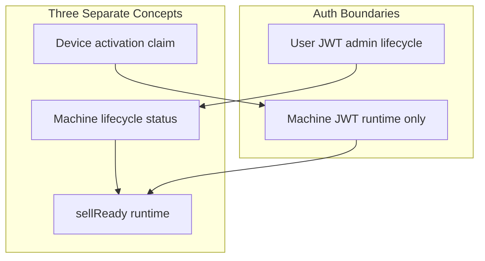

# Enterprise Flow API Surface — Re-Audit and Implementation Plan

All artifacts will be written under `reports/enterprise-flow/<UTC_TIMESTAMP>/` (e.g. `20260703T120000Z/`). No repomix files will be edited.

---

## A. Re-Audit Summary (answers A1–A54)

### Enterprise flow (A1–A21)

| # | Finding | Status |
|---|---------|--------|
| A1 | `machines.status` values: `draft`, `provisioned`, `provisioning`, `active`, `online`, `offline`, `maintenance`, `suspended`, `retired`, `decommissioned`, `compromised` | Exists — [`db/schema/01_platform.sql`](db/schema/01_platform.sql) |
| A2 | Lifecycle routes mounted: suspend/resume, archive/retire, mark-compromised, rotate/revoke credentials, revoke-sessions, transfer-site | Exists — [`internal/httpserver/admin_fleet_write_http.go`](internal/httpserver/admin_fleet_write_http.go) L52–68 |
| A3 | User JWT + RBAC; destructive lifecycle requires `RequireFleetMachineLifecycle` (`PermFleetWrite` + admin/fleet_manager) | Exists |
| A4 | Machine JWT blocked from `/v1/admin/*` via `RequireDenyMachinePrincipal` | **Enforced** — [`internal/platform/auth/middleware.go`](internal/platform/auth/middleware.go) |
| A5 | Activation claim records human account | **No** — only fingerprint hash, IP, UA |
| A6 | Activation claim records `operator_session_id` | **No** |
| A7 | request_id/correlation_id/app_version/boot_id/reason on claims | **No** (only `failure_reason` on failures) |
| A8 | `machine_sessions` canonical; `machine_runtime_refresh_tokens` schema-only (no app writes) | **Needs canonicalization doc + deprecate unused table path** |
| A9 | Machine JWT validates credential_version + session active/unrevoked | **Yes** — [`internal/grpcserver/machine_token_auth.go`](internal/grpcserver/machine_token_auth.go) |
| A10 | Refresh rotates refresh tokens | **Yes** — [`internal/app/activation/service.go`](internal/app/activation/service.go) L674+ |
| A11 | Refresh revokes old session | **Yes** (60s grace replay) |
| A12 | Lifecycle requires `reason` | **No** — handlers parse URL only (e.g. L727–748) |
| A13 | Lifecycle audit + action attribution | **Partial audit only** via `fleetAudit()`; **no** `machine_action_attributions` |
| A14 | Operator `ended_reason` normalized | **No** — free text; only 2 domain constants |
| A15 | Technician actions attributed | **Partial** — inventory/cash/workflows yes; lifecycle/activation no |
| A16 | Reattach API after reinstall | **Missing** |
| A17 | Admin runtime session current/history API | **Missing** |
| A18 | Unified ops-overview/timeline | **Partial** — `GET /v1/admin/machines/{machineId}/timeline` exists (commands/commerce/check-ins only); **no ops-overview** |
| A19 | Offline replay idempotent | **Yes** — sequence + client_event_id ledger |
| A20 | Offline event types | **Implemented** with different names (`commerce.*`, `inventory.*`, `telemetry.*`); enterprise aliases missing |
| A21 | Cash-only offline gaps | Policy app-side; backend needs alias events, attribution, reattach, lifecycle reason |

### REST surface (A22–A30)

| Metric | Baseline | **Current (recomputed)** |
|--------|----------|--------------------------|
| Paths | 268 | **268** — [`docs/swagger/swagger.json`](docs/swagger/swagger.json) |
| Operations | 329 | **329** |

**Mounted but missing OpenAPI (10 routes):**
- `GET /v1/admin/payment/providers`
- `GET/POST` payment ops: reconciliation, webhook-events, settlements, disputes, export, settlements/import, disputes/{id}/resolve — [`internal/httpserver/admin_payment_ops_http.go`](internal/httpserver/admin_payment_ops_http.go)
- `POST /v1/admin/media/product-images` (alias; `/v1/admin/product-images` is documented)

**OpenAPI-only / unwired:** `mountAdminPlanogramRoutes` enterprise planogram paths are only reachable via unwired `mountAdminCompanyFleetRoutes` — dead mount; legacy planogram routes in [`admin_inventory_http.go`](internal/httpserver/admin_inventory_http.go) are live.

**Must add for enterprise flow:**
- `POST /v1/admin/machines/{machineId}/reattach-device`
- `GET /v1/admin/machines/{machineId}/runtime-sessions/current`
- `GET /v1/admin/machines/{machineId}/runtime-sessions/history`
- `POST /v1/admin/machines/{machineId}/runtime-sessions/revoke`
- `GET /v1/admin/machines/{machineId}/ops-overview`
- Extend `GET /v1/admin/machines/{machineId}/timeline` (or replace with unified model)

**Harden only (exist, need reason/attribution/response shape):** all lifecycle POST routes in [`admin_fleet_write_http.go`](internal/httpserver/admin_fleet_write_http.go).

**Existing test coverage script:** [`scripts/test/rest_openapi_coverage.py`](scripts/test/rest_openapi_coverage.py) — OpenAPI→test mapping only; **does not** compare router vs OpenAPI.

### gRPC surface (A31–A39)

| Metric | Baseline | **Current** |
|--------|----------|-------------|
| Service definitions | 23 | **23** (13 `avf.machine.v1` + 7 `avf.internal.v1` + 3 legacy `avf.v1` unregistered) |
| RPC methods | 88 | **88** |

**Registered at runtime:** 20 services (13 machine + 7 internal) via [`internal/grpcserver/machine_grpc_services.go`](internal/grpcserver/machine_grpc_services.go) and [`internal/grpcserver/internal_queries.go`](internal/grpcserver/internal_queries.go).

**Intentionally unimplemented (7 RPCs):** `MachineOperatorService` Open/Close/Login/Logout; `MachineCommandService` GetPendingCommands/Ack/Reject (MQTT-primary).

**Auth classification:**
- Public: `ClaimActivation`, `RefreshMachineToken`, `ActivateMachine` (facade)
- Machine JWT: all other `avf.machine.v1.*`
- Internal JWT: all `avf.internal.v1.*`

**Enterprise gRPC changes needed:**
- Optional: add enterprise offline event type aliases in `PushOfflineEvents` dispatcher (backward-compatible)
- Document 7 unimplemented RPCs in surface report as accepted
- No breaking changes to production machine APIs

### MQTT surface (A40–A47)

**Production layout:** `{prefix}/machines/{machineId}/{rel}` — enforced when `MQTT_TOPIC_LAYOUT=enterprise`; legacy requires `PRODUCTION_ALLOW_LEGACY_MQTT_TOPIC_LAYOUT=true`.

**Enterprise device publish (12 rel paths):** commands/ack, commands/receipt, presence, state/heartbeat, telemetry, telemetry/snapshot, telemetry/incident, events, events/vend, events/cash, events/inventory, shadow/reported — [`internal/platform/mqtt/topics.go`](internal/platform/mqtt/topics.go).

**Enterprise subscribe:** `{prefix}/machines/{machineId}/commands`.

**Docs/code gaps (4):**
1. Enterprise ingest patterns not fully tabulated in [`docs/api/mqtt-contract.md`](docs/api/mqtt-contract.md)
2. `commands/receipt` omitted from Android contract test
3. `shadow/desired` ingested but not in publish path helpers
4. Generic `events` enterprise-only but omitted from JSON envelope channel list

**MQTT changes needed:** doc sync + test fixes only (no topic renames).

### Final audit (E48–E54)



**Schema migrations required:** `00016_enterprise_flow_accountability.sql` (activation claim fields, lifecycle event read model, ended_reason normalization view, optional deprecate comment on `machine_runtime_refresh_tokens`).

**Compatibility risks:**
- Adding required `reason` to lifecycle POST bodies is a **breaking API change** for existing admin clients — mitigate with phased enforcement (422 if missing after cutover date) or accept empty reason only for deprecated clients documented in report
- Timeline response shape change — version via new fields on existing endpoint rather than breaking rename
- Postman production suite must be regenerated via [`scripts/postman/generate_production_full_suite.py`](scripts/postman/generate_production_full_suite.py)

---

## B. Implementation Phases

### P0.1 — Preserve behavior + safety baseline

**Files:** snapshot git SHA, run existing `go test ./...`, record baseline counts in `00_ENTERPRISE_FLOW_AND_API_SURFACE_REAUDIT.md`.

**Pass criteria:** all existing tests green before changes; baseline counts recorded.

**Rollback:** no schema changes yet.

---

### P0.2 — API surface inventory validators

**Create:**
- [`tools/enterprise_flow/validate_rest_surface.py`](tools/enterprise_flow/validate_rest_surface.py) — parse OpenAPI + extract mounted routes from [`internal/httpserver/server.go`](internal/httpserver/server.go), `admin_*_http.go` mount functions, and/or [`internal/httpserver/router.go`](internal/httpserver/router.go); compare; emit `REST_SURFACE_COVERAGE.md/json`
- [`tools/enterprise_flow/validate_grpc_surface.py`](tools/enterprise_flow/validate_grpc_surface.py) — proto RPCs vs Go `Register*Server` + method implementations; auth classification from [`internal/grpcserver/interceptors.go`](internal/grpcserver/interceptors.go)
- [`tools/enterprise_flow/validate_mqtt_surface.py`](tools/enterprise_flow/validate_mqtt_surface.py) — `topics.go` vs `mqtt-contract.md` vs router channels
- [`tools/enterprise_flow/validate_postman_surface.py`](tools/enterprise_flow/validate_postman_surface.py) — compare Postman collection to OpenAPI/proto/MQTT inventory
- [`tools/enterprise_flow/validate_enterprise_flow_contract.py`](tools/enterprise_flow/validate_enterprise_flow_contract.py) — orchestrator; fails on undocumented drift

**Allowlist file:** `tools/enterprise_flow/accepted_surface_exceptions.json` for documented legacy/internal (payment ops gap until fixed, 7 unimplemented gRPC RPCs, avf.v1 unregistered protos).

**Pass criteria:** baseline run produces reports; known gaps explicitly listed.

---

### P0.3 — Schema migration: activation/accountability/session fields

**New migration:** `migrations/00016_enterprise_flow_accountability.sql`

**Changes to `machine_activation_claims`:**
- Add nullable: `activated_by_account_id`, `operator_session_id`, `request_id`, `correlation_id`, `app_version`, `boot_id`, `device_serial`, `reason`, `activation_source`
- Indexes: `(machine_id, claimed_at DESC)`, `operator_session_id`, `activated_by_account_id`, `correlation_id`, `activation_source`

**Lifecycle audit read model:** extend `enterprise_audit` metadata convention OR add `machine_lifecycle_events` table if query performance requires it (prefer extending existing [`compliance.EnterpriseAuditRecord`](internal/domain/compliance/) + new sqlc queries first).

**Operator ended_reason:** add `ended_reason_normalized` generated column or read-model view mapping legacy free-text → canonical set; validate on write in [`internal/app/operator`](internal/app/operator).

**SQLC:** update [`db/queries/activation.sql`](db/queries/activation.sql), new `db/queries/machine_runtime_sessions.sql`, `db/queries/machine_timeline.sql`.

**Backfill:** NULL for new columns; map known `ended_reason` strings where possible.

**Pass criteria:** migration applies; sqlc generates; integration test inserts claim with new fields.

---

### P0.4 — Canonical machine runtime session/token hardening

**Canonical table:** `machine_sessions` (keep); document `machine_runtime_refresh_tokens` as deprecated/unused in [`docs/api/machine-runtime.md`](docs/api/machine-runtime.md).

**Verify/enforce:**
- Refresh hash-at-rest only ([`plauth.HashRefreshToken`](internal/platform/auth))
- Plaintext refresh only in claim/refresh/reattach responses
- JWT claims: machine_id, session_id, credential_version, token_use=machine_access

**Admin read APIs (new):**
- `GET .../runtime-sessions/current` — active session metadata (no hash)
- `GET .../runtime-sessions/history` — paginated revoked/expired sessions
- `POST .../runtime-sessions/revoke` — reason + audit; optional operator_session_id

**Implementation:** new service in `internal/app/fleet` or `internal/app/activation`; handlers in new `admin_machine_runtime_http.go`; mount under `/v1/admin/machines/{machineId}/runtime-sessions/*` with `RequireDenyMachinePrincipal` + fleet read/write RBAC.

**Pass criteria:** tests prove no token hash in responses; refresh rotation unchanged.

---

### P0.5 — Machine lifecycle reason/audit/attribution hardening

**Shared request struct** (OpenAPI + handler):

```json
{
  "reason": "required",
  "notes": "optional",
  "operator_session_id": "required for technician-on-app",
  "correlation_id": "optional",
  "metadata": {}
}
```

**Standard response** with previous_status, new_status, credential_version, sessions_revoked_count, actor_account_id, occurred_at.

**Service layer:** extend [`internal/app/fleet/admin_crud.go`](internal/app/fleet/admin_crud.go) — `DisableMachine`, `EnableMachine`, `RetireMachine`, credential rotate/revoke accept `LifecycleMutationInput`; persist via [`internal/modules/postgres/fleet_lifecycle_repository.go`](internal/modules/postgres/fleet_lifecycle_repository.go).

**Attribution:** call [`insertOperatorSessionAttribution`](internal/modules/postgres/operator_attribution.go) from fleet lifecycle repository when operator_session_id present; always write enriched `EnterpriseAuditRecord` with old/new status, reason, request_id from context, correlation_id.

**Auth:** keep `RequireFleetMachineLifecycle`; add technician path via `PermTechnicianWrite` + active operator session validation helper (reuse operator session lookup).

**Pass criteria:** missing reason → 400; Machine JWT → 403; audit + attribution rows created.

---

### P0.6 — Reinstall recovery / reattach / reactivation

**New endpoint:** `POST /v1/admin/machines/{machineId}/reattach-device`

**Service:** extend [`internal/app/activation/service.go`](internal/app/activation/service.go) with `ReattachDevice(ctx, ReattachInput)`:
- User JWT actor from context (never trust body account id)
- Validate machine status not compromised/retired/decommissioned
- Validate fingerprint policy (match or admin override permission)
- Revoke prior active sessions; issue new session + tokens
- Insert activation claim with `activation_source=technician_reattach|admin_reattach`
- Audit + attribution

**Activation claim hardening:** extend `ClaimInput` with optional operator_session_id, correlation_id, app_version, boot_id, reason, activation_source; wire from HTTP/gRPC when authenticated context present.

**Pass criteria:** clean reinstall cannot get tokens without code or reattach; reattach denied for compromised machine.

---

### P0.7 — First-install / backend contract docs

**Update docs only (plus OpenAPI descriptions):**
- [`docs/api/kiosk-app-flow.md`](docs/api/kiosk-app-flow.md)
- [`docs/api/machine-grpc.md`](docs/api/machine-grpc.md)
- [`docs/api/machine-runtime.md`](docs/api/machine-runtime.md)
- [`docs/runbooks/technician-setup.md`](docs/runbooks/technician-setup.md)

Document Cases A–E from spec; clarify backend `active` ≠ device activated.

---

### P0.8 — Operator session ended_reason + accountability

**Write path validation:** normalize `ended_reason` on session close in [`internal/httpserver/operator_http.go`](internal/httpserver/operator_http.go) and gRPC heartbeat timeout paths.

**Allowed set:** client_logout, heartbeat_timeout, technician_token_expired, token_refresh_failed, superseded_by_same_operator, superseded_by_admin_takeover, admin_forced_close, app_crash_detected, device_reboot, safe_mode_entered, commissioning_completed, session_expired, server_revoked, unknown.

**Legacy mapping:** stale_session_reclaimed → superseded_by_same_operator; admin_forced_takeover preserved.

---

### P0.9 — Mandatory action attribution for technician/admin machine actions

**Wire attribution into:**
- Fleet lifecycle (P0.5)
- Activation/reattach (P0.6)
- Setup/commissioning handlers (port setup, config apply, hardware init) — grep `mountAdmin*` setup routes and add attribution calls
- Existing inventory/cash paths — verify correlation_id propagation

**Validation helper:** `requireActiveOperatorSession(ctx, machineID, operatorSessionID)` shared between HTTP and fleet service.

---

### P0.10 — Offline cash-safe policy and replay validation

**Extend [`dispatchOfflineEvent`](internal/grpcserver/machine_contract_grpc.go) with alias map:**

| Enterprise alias | Existing handler |
|------------------|------------------|
| order_created_offline | commerce.create_order |
| cash_accepted | commerce.confirm_cash_payment |
| vend_success | commerce.confirm_vend_success |
| vend_failure | commerce.confirm_vend_failure |
| inventory_decrement_pending | inventory.report_delta |
| hardware_error | telemetry.critical |
| refund_required | new reconciliation stub or commerce refund path |
| command_ack_pending | no-op/idempotent ack record |

**Reject** QR/card offline event types at validation layer with clear `InvalidArgument`.

**Tests:** extend [`machine_offline_p06_integration_test.go`](internal/grpcserver/machine_offline_p06_integration_test.go) and [`machine_replay_ledger_integration_test.go`](internal/grpcserver/machine_replay_ledger_integration_test.go).

---

### P0.11 — Admin ops-overview and unified timeline

**New:** `GET /v1/admin/machines/{machineId}/ops-overview` — aggregate query joining machines, credentials, current session, last claim, active operator session, health from [`adminops.MachineHealth`](internal/app/adminops/service.go), open incidents/orders.

**Extend timeline:** new sqlc query `AdminUnifiedMachineTimeline` UNION lifecycle audit, activation claims, runtime sessions, operator sessions, attributions, offline replay, commands, commerce — with filters (from/to, operator_session_id, correlation_id, event_type, cursor pagination).

**Response shape:** match spec timeline item schema in [`internal/httpserver/openapi_types.go`](internal/httpserver/openapi_types.go).

**Pass criteria:** suspend/resume appears in timeline; ops-overview shows active operator session + credential_version.

---

### P0.12 — REST/OpenAPI update + validation

**For every new/changed route:**
1. Handler in `internal/httpserver/`
2. `@Router` stub in [`swagger_operations.go`](internal/httpserver/swagger_operations.go)
3. Entry in `tools/build_openapi.py` `REQUIRED_OPERATIONS`
4. Types in [`openapi_types.go`](internal/httpserver/openapi_types.go)
5. Run `make swagger`

**Fix existing gaps:** add DocOp stubs for 10 payment/media routes.

**Expected counts after implementation:** ~274 paths / ~337 operations (document exact delta in final verdict).

---

### P0.13 — gRPC/proto update + validation

**Minimal proto changes:** optional comment updates in [`offline_sync.proto`](proto/avf/machine/v1/offline_sync.proto) documenting alias event types; no new RPCs unless reattach exposed via gRPC (REST-first per spec).

**Regenerate:** `make proto` or project equivalent.

**Update:** [`docs/api/machine-grpc-production-contract.md`](docs/api/machine-grpc-production-contract.md).

---

### P0.14 — MQTT contract update + validation

**Update [`docs/api/mqtt-contract.md`](docs/api/mqtt-contract.md):**
- Full enterprise ingest pattern table (13 patterns)
- Separate row for commands/receipt
- shadow/desired note
- Generic events in envelope list

**Fix test:** [`internal/platform/mqtt/enterprise_contract_test.go`](internal/platform/mqtt/enterprise_contract_test.go) — include commands/receipt in wantPublish.

---

### P0.15 — Postman update

**Regenerate:** [`scripts/postman/generate_production_full_suite.py`](scripts/postman/generate_production_full_suite.py) after OpenAPI changes.

**Validate:** `scripts/postman/validate-generated-api-suite.py` + new `validate_postman_surface.py`.

**Environment:** ensure `operatorSessionId`, `correlationId`, `machineId` variables in [`postman/suites/production-full/`](postman/suites/production-full/).

---

### P0.16 — Tests

| Layer | New/updated tests |
|-------|-------------------|
| Unit | lifecycle reason validation, ended_reason map, activation context, reattach policy, timeline mapping, surface validators |
| Integration | migration, claim fields, lifecycle attribution, reattach session revoke, runtime session queries, offline aliases |
| HTTP | `admin_fleet_lifecycle_http_test.go`, `admin_machine_runtime_http_test.go`, `admin_ops_overview_http_test.go`, Machine JWT denied |
| gRPC | existing production contract tests + offline alias cases |
| MQTT | enterprise contract test fix |
| Security | admin JWT rejected as Machine JWT; operator_session_id spoof |

---

### P1 — Production-safe smoke tests

Run e2e scripts: activation → token → bootstrap; suspend blocks gRPC; resume restores; offline replay after reconnect — [`tests/e2e/scenarios/`](tests/e2e/scenarios/).

---

### P2 — Final reports

**Create:**
- `FINAL_ENTERPRISE_FLOW_API_SURFACE_VERDICT.md/json` — answers all 40 verdict questions
- `API_SURFACE_FINAL_PARITY.md/json` — REST/gRPC/MQTT/Postman counts before/after

**Target verdict:** `ENTERPRISE_FLOW_API_SURFACE_IMPLEMENTED_AND_TESTED` (or `ENTERPRISE_FLOW_PARTIAL_BACKEND_READY_APP_FOLLOWUP_REQUIRED` if app-side offline policy docs remain the only gap).

---

## C. Key Files to Change (consolidated)

| Area | Primary files |
|------|---------------|
| Schema | `migrations/00016_*.sql`, `db/queries/activation.sql`, `db/queries/machine_auth.sql`, new timeline/runtime queries |
| Fleet lifecycle | `admin_fleet_write_http.go`, `internal/app/fleet/admin_crud.go`, `fleet_lifecycle_repository.go` |
| Activation/reattach | `activation/service.go`, `activation_http.go`, new admin reattach handler |
| Runtime sessions | new `admin_machine_runtime_http.go`, `machine_auth.sql` list queries |
| Ops/timeline | `adminops/service.go`, `admin_operations_http.go`, `db/queries/admin_operations.sql` |
| Operator | `operator_http.go`, `operator_repository.go`, `operator_attribution.go` |
| Offline | `machine_contract_grpc.go`, `offline_sync.proto` |
| OpenAPI | `swagger_operations.go`, `openapi_types.go`, `tools/build_openapi.py` |
| MQTT docs/tests | `mqtt-contract.md`, `enterprise_contract_test.go` |
| Validators | `tools/enterprise_flow/*.py` |
| Postman | `scripts/postman/generate_production_full_suite.py`, production-full collection |

---

## D. Run Order (execution sequence)

1. Create timestamped report dir + `00_REAUDIT.md` (content from Section A)
2. Create `01_IMPLEMENTATION_PLAN.md` (this document)
3. Run baseline tests; record counts
4. Implement P0.2 validators; run baseline validation
5. P0.3 migration → sqlc generate
6. P0.4–P0.11 feature implementation (can parallelize after schema)
7. P0.12–P0.15 docs/OpenAPI/Postman/MQTT
8. P0.16 tests
9. Re-run validators; fix until green
10. P1 smoke + P2 final verdict

---

## E. Acceptance Gates (final verdict)

- REST missing_in_openapi = 0 (after payment ops stubs added) unless in allowlist
- gRPC missing implementation = 0 except documented 7 RPCs + 3 legacy avf.v1
- MQTT docs/code mismatch = 0
- Machine JWT cannot admin lifecycle (existing + new tests)
- Lifecycle mutations require reason + write audit/attribution
- Activation claims link account/session when present
- Reattach requires User JWT + policy
- Token refresh rotates; hash never exposed
- ops-overview + unified timeline implemented
- All tests + validators pass
